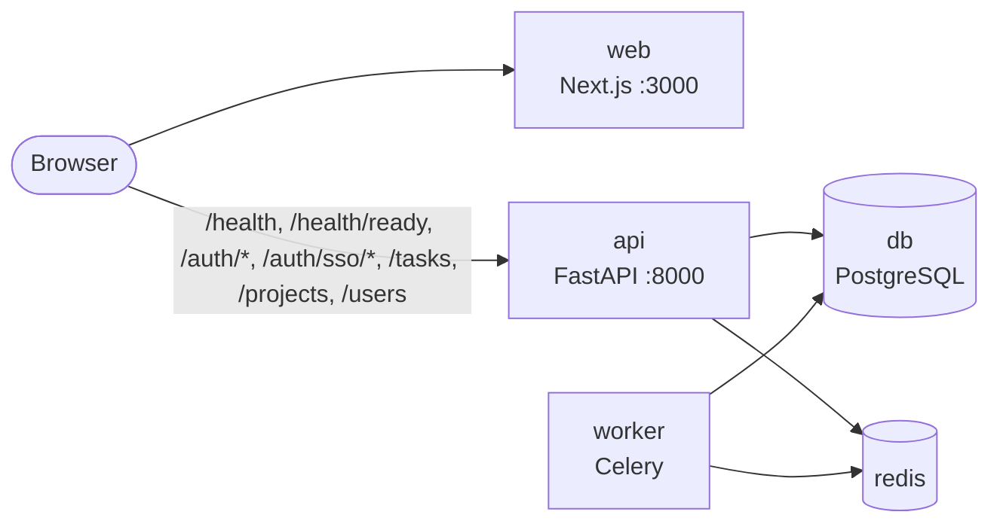
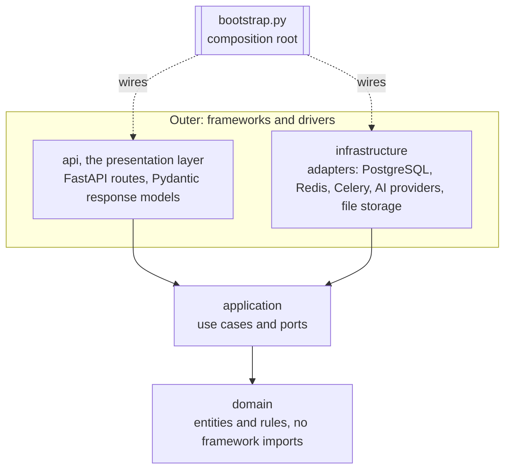
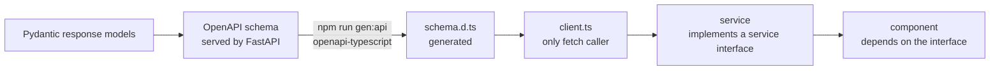
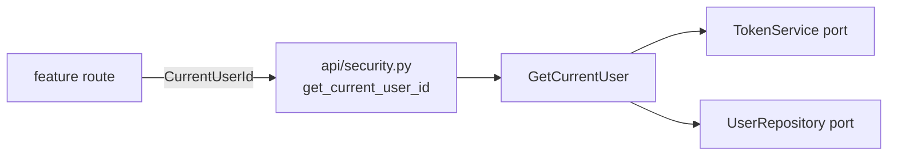

# Architecture

Ballast Tasks is a monorepo with two applications that share one HTTP contract:

- `apps/api`: a FastAPI service plus a Celery worker, built as ports and adapters (Clean Architecture).
- `apps/web`: a Next.js frontend whose components depend on service interfaces, never on the network.

This document is the authority for the rules summarised in [`AGENTS.md`](../AGENTS.md).
The reasons behind the two structural choices are recorded in
[ADR 0001](decisions/0001-monorepo.md) and [ADR 0002](decisions/0002-ports-and-adapters.md);
single sign-on is [ADR 0006](decisions/0006-single-sign-on.md).

## System overview



One `docker-compose.yml` at the repo root runs the five services: `db`, `redis`, `api`, `worker`, `web`.
PostgreSQL is the only database, in every environment, including integration tests.

## Layers and the dependency rule

Source code dependencies point inward only. An inner layer never imports an outer one.



| Layer | Contains | May import |
| --- | --- | --- |
| `domain` | Entities, value objects, domain rules | Standard library only |
| `application` | Use cases and the ports in `application/ports/` | `domain` |
| `infrastructure` | Adapters that implement ports | `application`, `domain`, third-party drivers |
| `api` (presentation) | Routes and Pydantic request/response models | `application`, `domain`, FastAPI |
| `bootstrap.py` | Composition root | Everything; nothing imports it except the entry points |

Two more rules sit across the layers:

- `apps/api/src/app/infrastructure/config/settings.py` is the only module that reads environment variables (pydantic-settings, nested groups with `env_nested_delimiter="__"`). Everything else receives typed settings objects.
- `api` (the presentation package) and `infrastructure` never import each other. They meet only through a port, wired in `bootstrap.py`.

The rule is not a convention: it is an import-linter contract in `apps/api`, checked by `uv run lint-imports` (part of `make lint` and of pre-commit). A forbidden import fails the build.

## Ports

Ports are `typing.Protocol` classes in `apps/api/src/app/application/ports/`, one file per port. They are deliberately small: a use case depends on exactly the capability it needs.

```python
class HealthCheck(Protocol):
    """One dependency whose liveness can be probed."""

    @property
    def name(self) -> str: ...          # "database" | "redis" | "ai"; the name shown in /health/ready

    def check(self) -> bool: ...        # True when healthy; must not raise


class JobQueue(Protocol):
    """Hands work to a background worker."""

    def enqueue(self, job_name: str, payload: Mapping[str, object]) -> str: ...   # returns the job id


class LanguageModel(Protocol):
    """A text-completion provider."""

    @property
    def provider(self) -> str: ...      # e.g. "fake"

    @property
    def model(self) -> str: ...         # e.g. "fake-1"

    async def generate(self, prompt: str) -> str: ...   # non-empty text, or a LanguageModelError
    async def check(self) -> bool: ...                  # never raises, never spends tokens


class TaskRepository(Protocol):
    """Stores tasks. Returned tasks are detached: a change is stored only by update."""

    async def add(self, task: Task) -> None: ...       # raises InvalidAssigneeError
    async def get(self, task_id: UUID) -> Task | None: ...
    async def get_by_key(self, key: TaskKey) -> Task | None: ...
    async def get_for_update(self, task_id: UUID) -> Task | None: ...  # holds the task until the unit of work ends
    async def search(self, query: TaskQuery, *, today: date) -> TaskPage: ...  # one page + the total
    async def count_open(self, *, viewer_id: UUID, today: date) -> TaskCounts: ...
    async def count_signals(self, task_filter: TaskFilter, *, today: date) -> SignalCounts: ...
    async def update(self, task: Task) -> None: ...    # raises TaskNotFound, InvalidAssigneeError, UnknownProjectError
    async def delete(self, task_id: UUID) -> None: ... # raises TaskNotFound


class ProjectRepository(Protocol):
    """Stores projects and hands out task keys. Every store starts with the Inbox."""

    async def add(self, project: Project) -> None: ...            # raises ProjectKeyTakenError
    async def get(self, project_id: UUID) -> Project | None: ...
    async def get_for_update(self, project_id: UUID) -> Project | None: ...
    async def overview(self, project_id: UUID) -> ProjectOverview | None: ...  # project + open-task count
    async def overviews(self) -> Sequence[ProjectOverview]: ...   # by name, one statement
    async def update(self, project: Project) -> None: ...         # raises ProjectNotFound
    async def allocate_task_key(self, project_id: UUID) -> TaskKey: ...  # no duplicates, no gaps; raises UnknownProjectError


class AttachmentRepository(Protocol):
    """The attachments of a task: added or deleted, never changed. The bytes are FileStorage's."""

    async def add(self, attachment: Attachment) -> None: ...        # raises TaskNotFound
    async def get(self, attachment_id: UUID) -> Attachment | None: ...
    async def list_for_task(self, task_id: UUID) -> Sequence[Attachment]: ...             # oldest first
    async def count_by_task(self, task_ids: Collection[UUID]) -> Mapping[UUID, int]: ...  # one statement
    async def delete(self, attachment_id: UUID) -> None: ...        # raises AttachmentNotFound


class FileStorage(Protocol):
    """The bytes behind a file attachment, under a server-generated key. No paths, no URLs."""

    async def save(self, key: str, chunks: AsyncIterator[bytes]) -> StoredFile: ...
    # exclusive (StorageKeyTakenError), streams, removes what a failed or cancelled write left
    async def open(self, key: str) -> AsyncIterator[bytes]: ...  # StoredFileNotFound before the stream
    async def delete(self, key: str) -> None: ...                # idempotent


class RateLimiter(Protocol):
    """Counts hits per key; atomic, so concurrent hits never exceed the policy's limit."""

    async def hit(self, key: str, policy: RateLimitPolicy) -> RateLimitDecision: ...
    # policy: name, limit, window_seconds; decision: allowed, limit, remaining, reset_after_seconds


class UserDirectory(Protocol):
    """The little the task use cases may ask about users: a yes or a no, and a name to log."""

    async def is_active_user(self, user_id: UUID) -> bool: ...  # unknown and inactive are both False
    async def full_name_of(self, user_id: UUID) -> str | None: ...  # active or not; None when unknown


class PeopleDirectory(Protocol):
    """Who a task can be given to, as other users may see them: a Person has no email."""

    async def list_active(self) -> Sequence[Person]: ...  # by full name, then id


class ActivityRecorder(Protocol):
    """Appends to a task's activity; the ONE way application code writes to the timeline."""

    async def record(self, entry: ActivityEntry) -> None: ...  # same unit of work as the change


class ActivityFeed(Protocol):
    """Reads a task's activity."""

    async def page(self, task_id: UUID, *, limit: int, offset: int) -> ActivityPage: ...  # newest first


class StepRepository(Protocol):
    """Stores the steps of tasks; positions are the use cases' job. Deleting a task deletes them."""

    async def add(self, step: Step) -> None: ...
    async def list_for_task(self, task_id: UUID) -> Sequence[Step]: ...  # by position
    async def update(self, step: Step) -> None: ...    # raises StepNotFound
    async def delete(self, step_id: UUID) -> None: ... # raises StepNotFound


class TaskTallies(Protocol):
    """Step progress, comments_count and attachments_count: one statement for many tasks."""

    async def for_tasks(self, task_ids: Sequence[UUID]) -> Mapping[UUID, TaskTally]: ...


class IdentityProvider(Protocol):
    """An external identity provider, driven with the authorization-code flow."""

    @property
    def name(self) -> str: ...          # "google" | "fake": the URL segment and the stored provider key

    async def authorization_url(self, *, state: str, nonce: str, redirect_uri: str) -> str: ...
    async def exchange(self, *, code: str, redirect_uri: str, nonce: str) -> VerifiedIdentity: ...
    # VerifiedIdentity: provider, subject, email, email_verified, full_name
    # raises IdentityCodeRejectedError, IdentityProviderUnavailableError


class UserIdentityRepository(Protocol):
    async def find_user_id(self, provider: str, subject: str) -> UUID | None: ...
    async def link(self, user_id: UUID, provider: str, subject: str, *, linked_at: datetime) -> None: ...
    # raises IdentityAlreadyLinkedError


class OneTimeStore(Protocol):
    """Short-lived values that can be read exactly once."""

    async def put(self, key: str, value: str, *, ttl: timedelta) -> None: ...
    async def take(self, key: str) -> str | None: ...   # atomic read-and-delete
```

**Recording activity from a new feature** (attachments, for instance) is three lines in its use case and no change to any existing module: take an `ActivityRecorder` in the constructor (`RequestScope.activity` in `bootstrap.py` is the one bound to the request's session), write the sentence as a function in `app/domain/activity_log.py` (the only module that spells a log line), and after the change is stored call

```python
await self._activity.record(
    ActivityEntry.log(entry_id=uuid.uuid4(), task_id=task.id, actor_id=actor_id, text=activity_log.attachment_added(name), now=now)
)
```

The entry commits or rolls back with the change, because the recorder never commits. A change that altered nothing records nothing. Why a port and not a trigger or the route: [ADR 0007](decisions/0007-steps-and-activity.md).

`TaskRepository` has no clock: every question that depends on the date takes `today` from the use case (see [Time](#time)). `TaskQuery`, `TaskFilter`, `TaskPage` and the count types are plain values in `application/task_query.py`.

The Protocol files are the source of truth for exact signatures; if this section and the code disagree, the code wins and this section is corrected in the same commit.

Adapters in this setup:

| Port | Adapters | Notes |
| --- | --- | --- |
| `HealthCheck` | `database`, `redis`, `ai` | One entry per adapter appears in `GET /health/ready` |
| `JobQueue` | Celery (Redis broker), in-memory fake for unit tests | Fire-and-forget jobs; unchanged by generation |
| `StepGenerationJobs` | Celery with its Redis result backend, in-memory test fake | Only `enqueue(task_id)` and `get(task_id, job_id)`; task association and one-hour retention distinguish unknown from pending. `tests/contract/test_step_generation_jobs_contract.py` holds both adapters to the same contract |
| `AttachmentRepository` | SQLAlchemy/PostgreSQL, in-memory fake | `tests/contract/test_attachment_repository_contract.py`; metadata belongs to one task, counts are batched, task deletion cascades rows |
| `FileStorage` | Local disk (`local`), in-memory fake | Streaming `save`, `open`, idempotent `delete` only; `tests/contract/test_file_storage_contract.py`. Selected through `STORAGE__PROVIDER` and `infrastructure/storage/registry.py`; [ADR 0008](decisions/0008-file-storage.md) |
| `LanguageModel` | `fake` (default, offline), `openrouter`, `gemini` | The real ones are plain `httpx`, no vendor SDK ([ADR 0003](decisions/0003-llm-adapters-over-http.md)). All three pass `tests/contract/test_language_model_contract.py`; the real ones run it against a stubbed transport |
| `TaskRepository` | SQLAlchemy on PostgreSQL, in-memory fake for unit and API tests | Both pass `tests/contract/test_task_repository_contract.py`; the PostgreSQL run is under the `integration` marker. Filters, sorts, paging and counts run in SQL (`infrastructure/db/repositories/task_queries.py`); the fake answers the same cases with the domain's rules, and both are held to literal expectations and to the design's urgency function. An unknown project is refused like an unknown assignee (`UnknownProjectError`). `add` and `update` raise `InvalidAssigneeError` when the assignee is not a stored user: the foreign key is the guarantee, and the write runs in a savepoint so the rest of the unit of work survives the rejection |
| `ProjectRepository` | SQLAlchemy on PostgreSQL, in-memory fake for unit and API tests | Both pass `tests/contract/test_project_repository_contract.py`. `add` raises `ProjectKeyTakenError` from the unique constraint, inside a savepoint. `allocate_task_key` is one `UPDATE ... RETURNING` on the project row; what needs two transactions at once is in `tests/integration/test_task_key_allocation.py` ([ADR 0005](decisions/0005-task-keys-and-urgency.md)) |
| `StepRepository` | SQLAlchemy on PostgreSQL, in-memory fake | Both pass `tests/contract/test_step_repository_contract.py`, paired there with the task and user stores their rows point at (`tests/contract/conftest.py`); the PostgreSQL run is under the `integration` marker |
| `ActivityRecorder`, `ActivityFeed` | One SQLAlchemy class over `task_activity` (`SqlAlchemyActivityLog`), one in-memory fake | Two ports, one suite: `tests/contract/test_activity_log_contract.py` checks that what one records the other reads back, newest first, naming the actor even when that user has been deactivated; no port exposes an email |
| `TaskTallies` | SQLAlchemy on PostgreSQL (one statement for a whole page), in-memory fake | Both pass `tests/contract/test_task_tallies_contract.py`; that the SQL one costs a single statement is asserted where statements are counted, `tests/integration/test_steps_activity_api.py` |
| `PeopleDirectory` | The same SQLAlchemy class as `UserDirectory` (it selects three columns, never the email or the hash), in-memory fake | Both pass `tests/contract/test_people_directory_contract.py`. A separate port so a double of one does not have to implement the other |
| `UserDirectory` | SQLAlchemy on PostgreSQL (`SELECT EXISTS` for the yes-or-no, one column for the name; no row loaded), in-memory fake over the users fake | Both pass `tests/contract/test_user_directory_contract.py`. It is how `CreateTask` and `UpdateTask` validate an assignee without importing an auth use case or the `UserRepository`, and how a use case gets the name a log line needs |
| `UserRepository` | SQLAlchemy on PostgreSQL, in-memory fake for unit and API tests | Both pass `tests/contract/test_user_repository_contract.py`. `add` raises `EmailAlreadyRegisteredError`, also when a concurrent transaction wins: the unique constraint is the guarantee, and the insert runs in a savepoint so the rest of the unit of work survives the rejection |
| `PasswordHasher` | Argon2id (`argon2-cffi`), reversible fake for tests | Synchronous and CPU-bound; use cases call it through `asyncio.to_thread` |
| `RateLimiter` | Redis (one Lua script per hit), in-memory, and `FailOpenRateLimiter`, which wraps the first with the second | All three pass `tests/contract/test_rate_limiter_contract.py`; the Redis run is under the `integration` marker. The in-memory adapter serves the tests and stands in while Redis is unreachable |
| `TokenService` | JWT (`PyJWT`, HMAC), in-memory fake for tests | Tokens carry only `sub`, `iat`, `exp`; `decode` raises `InvalidTokenError` |
| `IdentityProvider` | `google` (`httpx`, OpenID Connect with discovery, ID token verified with `PyJWT` against Google's cached keys), `fake` (no credentials; tests and local demos, refused when `APP__ENV=production`) | Both pass `tests/contract/test_identity_provider_contract.py`; Google runs against a stand-in Google (`httpx.MockTransport`, local signing keys). Registered in `infrastructure/identity/registry.py`, switched on by `SSO__ENABLED_PROVIDERS`; each factory names the variable it misses and stops startup |
| `UserIdentityRepository` | SQLAlchemy on PostgreSQL, in-memory fake | Both pass `tests/contract/test_user_identity_repository_contract.py`. `link` raises `IdentityAlreadyLinkedError`, also when a concurrent transaction wins: the two unique constraints are the guarantee, in a savepoint |
| `OneTimeStore` | Redis (`SET PX` / `GETDEL`), in-memory fake with a clock | Both pass `tests/contract/test_one_time_store_contract.py`. Holds the state of a sign-in and the one-time exchange code, keyed by SHA-256 digests |

## Composition roots

There are exactly two places where concrete classes are chosen. No DI framework or container library is used.

### Backend: `apps/api/src/app/bootstrap.py`

- Loads settings once, builds the adapters, and hands them to the use cases and the FastAPI app.
- Reads the provider registry (`AI__PROVIDER` value -> `LanguageModel` factory, in `infrastructure/ai/registry.py`) and holds the ordered list of `HealthCheck` adapters. The identity provider registry (name -> `IdentityProvider` factory, in `infrastructure/identity/registry.py`) is read the same way; `SSO__ENABLED_PROVIDERS` picks from it, and `STORAGE__PROVIDER` picks the `FileStorage` factory in `infrastructure/storage/registry.py`.
- An unknown `AI__PROVIDER` or `STORAGE__PROVIDER` fails at startup with an explicit error, not at first use.
- Tests build the app through the same function with fakes passed in, so no test patches a module global.

### Unit of work: one transaction per request

Repositories never commit. `Container.request_scope()` (built in `bootstrap.py`) opens one `AsyncSession` from the container's `session_factory`, binds every repository to it, exposes the use cases on top of them as a `RequestScope`, and commits when the block ends normally or rolls back when it raises. The commit/rollback itself is `transactional_session` in `infrastructure/db/unit_of_work.py`, whose module docstring is the authority for this mechanism.

- The HTTP layer enters the scope once per request through `get_request_scope` in `api/dependencies.py`. It is declared with `Depends(..., scope="function")`, so the transaction ends before the response is sent: a commit that fails becomes an error response.
- `RequestScope.clock` is the one clock every date-dependent use case receives; API tests replace it to pin "today".
- A new repository is one more field on `RequestScope` and one more argument where the scope is built. Use cases keep receiving ports, never a session.
- Resolving the caller (`GetCurrentUser`, through `api/security.py`) is a read of the request's own unit of work, like every other. The exception is the file upload: a route that waits for the client must hold no database connection while it does, and a dependency on the request's scope would hold one for the whole route, so that route is guarded by `get_streaming_user_id` and `limit_streaming_requests`, which read the caller in a unit of work that ends before the route runs. Nothing else changes: the 401s, the seam and the limiter policies are the same ([ADR 0008](decisions/0008-file-storage.md)).
- One use case spans more than one unit of work, and is therefore built on `Container` instead of `RequestScope`: `AttachFile` checks the task in one, streams the uploaded bytes to the `FileStorage` with none open, and writes the row in a second ([ADR 0008](decisions/0008-file-storage.md)).
- Outside HTTP (a Celery job, a script) the same `container.request_scope()` is the unit of work.
- Tables arrive only through Alembic revisions. ORM models live in `infrastructure/db/models/`; importing that package registers them on `Base.metadata`, which has a naming convention so every constraint has a stable name.

### Frontend: `apps/web/src/app/providers.tsx`

- Builds session-scoped HTTP services through `client.ts` by default and provides them through React context. `NEXT_PUBLIC_SERVICE_MODE=demo` explicitly selects the in-memory design fixtures; failures never silently switch modes. The existing workspace is the single data owner, with server-side queries, pagination and counts.
- Components and hooks read the service interface from context. They never import `client.ts` or call `fetch`.
- `config.ts` is the only application module that reads `process.env` (`NEXT_PUBLIC_API_URL`, `NEXT_PUBLIC_SERVICE_MODE`). Test tooling (`playwright.config.ts`, `apps/web/visual/`) reads its own variables.
- Password registration/login and the SSO callback establish a memory-only bearer session. Full reload/new tab requires sign-in again, without losing PostgreSQL data. Logout/401 disposes session services, unmounts the workspace and fences late responses. No browser credential persistence, refresh token or cookie-session subsystem is added. See [web integration](../apps/web/README.md#authentication-and-http-integration) for the service and polling contracts.
- Tests render components with a fake service passed to the provider; no network mocking is needed.

## HTTP contract flow

The API owns the contract. Frontend types are generated from it, never written by hand.



Rules:

- Any API response change updates the Pydantic model, runs `npm run gen:api`, fixes the frontend types, and lands in the same commit.
- `schema.d.ts` is generated. It is never edited by hand.
- `client.ts` is the only module that calls `fetch`. Services wrap it and return the generated types.

### Pinned health contract

`GET /health` -> always `200`:

```json
{"status": "ok"}
```

`GET /health/ready` -> `200` when every check passes, `503` when any fails; the SAME body shape in both cases:

```json
{
  "status": "ready",
  "checks": [
    {"name": "database", "status": "ok"},
    {"name": "redis", "status": "ok"},
    {"name": "ai", "status": "ok"}
  ],
  "ai": {"provider": "fake", "model": "fake-1"}
}
```

- `status`: `"ready" | "not_ready"`.
- `checks`: ordered list, one entry per registered `HealthCheck`; `name` is the adapter's `name`, `status` is `"ok" | "failed"`. It is a list (not fixed keys) on purpose: adding a check is a new adapter plus one registration line, with no schema or frontend change (open/closed).
- `ai`: static description of the configured `LanguageModel` (`provider`, `model`); the AI's liveness is the `"ai"` entry in `checks`.
- Pydantic model names (these become the OpenAPI component names the frontend types import): `HealthResponse`, `ReadinessResponse`, `ComponentStatus`, `AiInfo`. The `503` response must be declared in the route's `responses=` with the same `ReadinessResponse` model so it appears in OpenAPI.
- Check names are exactly `database`, `redis`, `ai`. The frontend labels them "Database", "Redis", "AI"; "API" status on the page comes from `GET /health`.

### Task contract

Every task route depends on `CurrentUserId` from `api/security.py`, the seam between tasks and authentication: `get_current_user_id` returns the caller's user id (a UUID) or answers `401`. Task routes never see a token, a `User` or the users table.

| Route | Success | Errors |
| --- | --- | --- |
| `POST /tasks` | `201` `TaskResponse` | `401`, `422` (also: assignee is not an active user, project does not exist) |
| `GET /tasks` | `200` `TaskListResponse`: `{"items": [TaskResponse, ...], "total", "limit", "offset"}` | `401`, `422` (a parameter it does not understand) |
| `GET /tasks/summary` | `200` `TaskSummaryResponse`: `counts`, `projects`, `signals` | `401`, `422` |
| `GET /tasks/{id_or_key}` | `200` `TaskDetailResponse` (`TaskResponse` plus `steps` and `attachments`) | `401`, `404`, `422` (neither an id nor a key) |
| `PATCH /tasks/{id_or_key}` | `200` `TaskResponse` | `401`, `404`, `422` (also: the assignee changes to somebody who is not an active user, the project changes to one that does not exist) |
| `DELETE /tasks/{id_or_key}` | `204`, no body | `401`, `404`, `422` |

- `TaskResponse`: `id`, `key`, `project_id`, `title`, `description`, `status` (`todo | in_progress | testing | done`), `due_date`, `created_by`, `assignee_id`, `created_at`, `updated_at`, `completed_at`, `priority` (`P0` to `P3`, default `P2`), `importance` (0 to 100, default 50), `attention`, `steps_total`, `steps_done`, `comments_count` and `attachments_count` (see [task attachments](#task-attachments)).
- **Key**: `<PROJECT KEY>-<NN>` (`BT-04`), allocated per project when the task is created and never changed, not even when `project_id` moves the task. `{id_or_key}` accepts the id or the key in any case and padding (`bt-4`). How keys are allocated without duplicates or gaps: [ADR 0005](decisions/0005-task-keys-and-urgency.md).
- **Attention**: `is_overdue`, `is_due_soon`, `is_p0_at_risk`, `needs_owner`, `days_until_due`, `urgency` and `reasons` (`overdue`, `p0_at_risk`, `due_today`, `due_soon`, `needs_owner`), computed by `app.domain.attention` from the request scope's clock, so a client does not re-implement the design's rules.
- **List parameters**, all optional, all combined with AND: `scope` (`all`, `mine`, `overdue`), `project_id`, `status` (`open`, the default; `all`; or one or more statuses by repeating it), `due` (`overdue`, `today`, `week`, `none`), `due_before` and `due_after` (inclusive), `priority` (repeatable), `assignee_id` (a user id or `unassigned`), `q` (case-insensitive, title or description; `%` and `_` are text, a control character such as NUL is a `422`), `signal` (one chip of the Attention strip), `sort` (`urgency`, the default; `importance`; `due_date`; `updated`), `limit` (default 50, max 200) and `offset`. An unknown parameter is a `422`, not ignored. Filtering, sorting and counting happen in SQL; a list request issues four statements for a nonempty page (the caller, page, total and batched steps/comment/attachment tallies); empty pages need no count lookup.
- **Summary**: `counts` (`all`, `mine`, `overdue`) and `projects` (each with `open_tasks`) describe the open tasks of the whole workspace, whatever is filtered, as the design's sidebar does. `signals` (`overdue`, `p0_at_risk`, `due_soon`, `needs_owner`) describes the open tasks the filters select; it takes the same filter parameters as the list and ignores `status` and `signal`, so choosing a chip never blanks the others.
- `POST` accepts `status` (the board adds a task straight into a column; `done` completes it at once), `priority`, `importance` and `project_id` (absent: the Inbox).
- `created_by` is the authenticated user; request bodies reject unknown fields, so it cannot be sent.
- `PATCH` is partial: an absent field is left alone, `null` clears `description`, `due_date` and `assignee_id`; `title`, `status`, `priority`, `importance` and `project_id` reject `null`, and there is no `key` to send. Completing a task is `{"status": "done"}` (the domain sets `completed_at`, and clears it when the task leaves `done`); assigning it is `{"assignee_id": "<user id>"}`.
- **Assignee**: an `assignee_id` that `POST` sets or `PATCH` changes must be an active user. Otherwise the answer is `422` with `{"type": "invalid_assignee", "loc": ["body", "assignee_id"], "msg": "assignee_id must be the id of an active user"}`, the same body for an unknown id and for a deactivated user. `CreateTask` and `UpdateTask` ask the `UserDirectory` port; the foreign key below is the race-safe backstop, and the repository maps its violation to the same `InvalidAssigneeError`, so a user who vanishes between the check and the write is still a `422`, never a `500`. `PATCH` checks the assignee only when the assignment changes: a body that names the `assignee_id` the task already has is accepted even if that user has since been deactivated (a form that saves the whole task sends it back), while a body that changes the assignee to an unknown or inactive user is the `422` above. So a task whose assignee was deactivated later can still be edited, completed or reassigned.
- The list is an envelope on purpose: pagination added `total`, `limit` and `offset` next to `items` without breaking clients.
- Any authenticated user can read and change any task and any project (one shared workspace, accepted for now); there is no ownership or membership model.
- Error bodies: `ErrorResponse` (`{"detail": "<message>"}`) for `401` and `404`; FastAPI's `HTTPValidationError` (`{"detail": [{"type", "loc", "msg"}, ...]}`) for `422`, whether a Pydantic model or a domain rule rejected the request. Application and domain errors are mapped to HTTP in `api/errors.py` only. Only a rule broken by the request is a `422`: a stored task the domain rejects is `StoredTaskInvalid`, which is not mapped and so is a `500`.
- Title and description reject the NUL character (PostgreSQL text cannot hold it).
- Concurrent `PATCH`es of one task are serialised: `UpdateTask` loads it with `get_for_update` (`SELECT ... FOR UPDATE`), so the second writer waits and works from what the first one stored. The `tasks` table backs the rule with `CHECK ((status = 'done') = (completed_at IS NOT NULL))`, so `testing` is open work like `todo` and `in_progress`.

### Task attachments

Every task representation includes `attachments_count`. `GET /tasks/{id_or_key}` returns
`TaskDetailResponse`, which also includes `attachments` in creation order. Counts use one
batched query, never one query per task. `AttachmentResponse` exposes id, task_id, kind
(`link`, `pdf`, `image`), name, created_by, created_at, url, content_type and size_bytes;
file storage keys remain internal. Attaching/removing touches the task's `updated_at` and
records `Attached <name>` / `Removed <name>` through the existing `ActivityRecorder`, in
the same transaction and attributed to the caller. Refused operations create no log entry.
Attachment counts share the `TaskTallies` query with steps/comments, preserving the
four-statement list budget; the contract suite checks that none of these counts multiply.

| Route | Success | Errors (standard bodies) |
| --- | --- | --- |
| `POST /tasks/{id_or_key}/attachments/links` | 201 `AttachmentResponse` | 401, 404, 422, 429 |
| `POST /tasks/{id_or_key}/attachments/files` | 201 `AttachmentResponse` | 401, 404, 413, 415, 422, 429 |
| `GET /tasks/{id_or_key}/attachments/{attachment_id}/content` | 200 streamed file | 401, 404 (also links/missing bytes), 422, 429 |
| `DELETE /tasks/{id_or_key}/attachments/{attachment_id}` | 204 | 401, 404, 422, 429 |

Links accept only absolute http(s) URLs, at most 2000 characters, without credentials;
optional name defaults to the host. URLs are never fetched. File upload accepts exactly
one multipart `file` part. Parsing and size enforcement are incremental, including before
any framework spooling; the default limit is 10 MiB (`STORAGE__MAX_BYTES`). Signatures
allow PDF/PNG/JPEG/GIF/WebP, not client-provided MIME types. Names are sanitised display
metadata, not keys. Downloads carry an encoded attachment Content-Disposition and nosniff.

`FileStorage` is a small application Protocol, whose registry-selected adapter is built
only in `bootstrap.py`. An upload runs as two short units of work with the body streamed
between them, so a slow sender holds neither a task row nor a database connection.
`FileChanges` follows each transaction: compensate new writes on rollback and defer
removals until after commit. Removing a task also removes all of
its stored files. No static mount. The API's named `attachments-data` volume persists the
local root from `STORAGE__LOCAL_DIRECTORY`. Local-disk guarantees, failure windows and the
cloud-adapter checklist are in [ADR 0008](decisions/0008-file-storage.md).

Revision `c4a9e7d21b65` adds one table after steps and activity. Existing rows are untouched:
counts start at zero, no backfill. Downgrade drops only attachment metadata; operators
must remove orphaned files. `tests/integration/test_attachments_migration.py` proves
upgrade with populated rows and downgrade. Transaction cleanup, including failed commit,
and real TCP HTTP are covered by `tests/integration/test_file_attachments.py`.

### Steps and activity

All routes below accept a task UUID or key, use the same `CurrentUserId` seam and rate limiter as tasks, and declare `401`, `404`, `422` and `429`.

| Route | Success |
| --- | --- |
| `GET /tasks/{id_or_key}/steps` | `200`, `{items: [StepResponse, ...]}` in position order |
| `POST /tasks/{id_or_key}/steps` | `201`, appended step; body `{title}` |
| `POST /tasks/{id_or_key}/steps/bulk` | `201`, `{items}`; body `{titles}` with 1–20 titles, all or none |
| `PATCH /tasks/{id_or_key}/steps/{step_id}` | `200`, renamed/ticked/unticked step; body `{title?, done?}` |
| `PUT /tasks/{id_or_key}/steps/order` | `200`, `{items}`; body `{step_ids}` must be an exact permutation |
| `DELETE /tasks/{id_or_key}/steps/{step_id}` | `204`, following positions compacted |
| `POST /tasks/{id_or_key}/comments` | `201`, immutable activity entry; body `{text}` |
| `GET /tasks/{id_or_key}/activity` | `200`, `{items, total, limit, offset}`, newest first; default limit 50, max 200 |

A task holds at most 100 steps ([ADR 0007](decisions/0007-steps-and-activity.md)): an add that would cross the ceiling is a `422` and adds nothing, not even part of a batch, and `step_ids` is bounded by the same number. Step titles are trimmed, 1–200 characters; comments are trimmed, 1–2000. Both reject NUL. An entry exposes `id`, `task_id`, `kind` (`log` or `comment`), `text`, `created_at` and `actor: {id, full_name, initials}`—never email. Only the detail task response contains ordered steps; all task representations contain step progress, comment and attachment tallies.

| Table | Stored columns and invariants |
| --- | --- |
| `task_steps` | UUID `id`, `task_id` (FK tasks, cascade), `title`, `done`, nonnegative `position`, `created_at`; `(task_id, position)` unique, deferred until commit |
| `task_activity` | UUID `id`, private bigint identity `seq`, `task_id` (FK tasks, cascade), `kind` constrained to log/comment, `text`, `actor_id` (FK users, restrict), `created_at`; feed index `(task_id, created_at, seq)` and partial comment-count index |

Every step writer locks its task before reading positions. Activity is recorded in application use cases through `ActivityRecorder.record(entry)` in the same transaction as the change, never in controllers or triggers. Equal timestamps are ordered by recording sequence. Both tables arrive in revision `a1c5e7f90b24`, whose `upgrade` docstring is the authority for what happens to a database that already holds tasks: they gain only a creation log at their original timestamp, and no task is modified. See [ADR 0007](decisions/0007-steps-and-activity.md) for exact wording, ordering, migration and downgrade policy. Contract suites exercise the fake and PostgreSQL adapters; `test_steps_activity_api.py` asserts constant list query count and rollback, and `test_step_positions_concurrency.py` exercises concurrent writers.

### Queued step generation

| Route | Success | Errors |
| --- | --- | --- |
| `POST /tasks/{id_or_key}/step-generations` (no body) | `202` `StepGenerationResponse`, a new pending handle | `401`, `404` task missing, `422`, `429`, `503` queue/backend unavailable |
| `GET /tasks/{id_or_key}/step-generations/{job_id}` | `200` `StepGenerationResponse` | `401`, `404` task or retained job missing/mismatched, `422`, `429`, `503` backend unavailable |

`StepGenerationResponse` is `{id, task_id, state, titles, error}`. `state` is exactly
`pending`, `running`, `success` or `failure`. Success has 1–20 trimmed, nonempty titles,
1–200 characters each, with no NUL, and `error: null`; every other state has `titles: []`.
Failure exposes only a fixed code: `invalid_output`, `provider_unavailable`, `timeout`
or `worker_failed`. It never exposes the provider response, exception, traceback, hostname
or credentials. Failures are normal poll responses (`200`); a missing
job is **not** a successful empty result.

- These routes use the normal shared-workspace authentication and rate limits. The task
  must still exist on **every** request. Another task's job handle, an unknown handle and
  an expired handle are all `404`. Deleting a task immediately makes its jobs inaccessible;
  the worker also checks deletion before and after generating. A task deleted while a poll
  is in flight is `404` too: the worker's internal `task_deleted` outcome is a missing
  generation, never a failure code, so no response can carry it. That shared authenticated
  allowance is the **only** bound on enqueue: there is no generation quota, per-task
  in-flight cap or deduplication, so on a paid provider an authenticated caller inside the
  allowance can start as many billable generations. The message expiry and the model
  deadline below bound backlog and job duration, not spend.
- Each POST is a new independent job, including retries/regeneration. Retain the returned
  task id and job id while changing selection and poll that handle on return. There is no
  server-side 'current selection', latest-job lookup or cancellation. Discarding/removing
  proposals is client state. A client stops polling on a terminal state and otherwise
  backs off: 2s, 4s, 8s, then every 10s until the deadline, and at the 10s bound for a
  generation whose task is not the selected one. That keeps two concurrent generations
  well inside the shipped authenticated budget (120 requests per 60s), which this feature
  does not change and has no policy of its own. On `429` a client waits the `Retry-After`
  seconds before its next poll instead of retrying immediately.
- A reservation in the **existing Redis result backend**, expiring one hour after enqueue,
  stores only the task id and enqueue timestamp. Native Celery results hold running state
  and the safe outcome. The reservation distinguishes Celery's ambiguous `PENDING`
  (which otherwise includes nonexistent jobs) and keeps association through worker death.
  No SQL table or migration is needed. Redis data loss may make jobs `404`; results are
  ephemeral proposals, not durable task content. Native results also expire after one hour
  from completion, but are never exposed after the reservation expires.
- Queue messages expire after five minutes. Pending/running jobs beyond that end-to-end
  deadline poll as `failure/timeout`; late completions cannot replace that with success.
  A completion recorded before the deadline remains available for the reservation's lifetime.
  The model deadline is `min(AI__TIMEOUT_SECONDS, 240)` seconds; the Celery hard execution
  limit is 250 seconds (use a prefork worker for hard-limit enforcement). There is no
  automatic retry or duplicate acceptance. Enqueue acknowledgement loss can leave an
  unreturned job running; it has no task-write effects and expires normally.
- `app.worker` is the worker entrypoint; `bootstrap.build_worker` supplies the job callable.
  A process builds its Celery application once: the worker passes its own into
  `build_container`, so a job composes only the async handles it closes again. A job that
  fails outside the model boundary still answers `worker_failed`, and logs one warning
  naming the task id and a fixed category (`configuration`, `database`, `cache` or
  `unexpected`) — never the exception, its message or a traceback.
  The worker reads the task title, description and existing step titles in a short
  `Container.request_scope()`, **closes it before awaiting the model**, then rechecks
  existence in another short scope. `GenerateStepTitles` depends only on `LanguageModel`.
  It treats task text as untrusted JSON context and accepts only a JSON array, not fenced
  Markdown or executable text. The whole response is rejected if malformed, empty, over
  32,768 characters, over 20 titles, or any title violates the step domain rule or contains
  invalid Unicode (such as an unpaired surrogate escape). Titles are never repaired by
  replacing invalid characters.
- Generation and polling never write steps, touch task timestamps or add activity.
  Accept chosen titles with the existing atomic `POST /tasks/{id_or_key}/steps/bulk`.
  Its 100-step ceiling is checked at **acceptance**, including concurrent writers; no
  generation reserves room or bypasses that rule. UI/HTTP service wiring is separate.

Tests: `test_generate_step_titles.py` covers the model boundary; `test_generation_worker.py`
proves the transaction is closed during generation; `test_step_generation_results.py`
exercises native Redis result states/retention; `test_step_generation_served.py` runs real
HTTP and a real Celery worker against PostgreSQL/Redis with a deterministic offline model
and prints a redacted request/poll transcript with `-s`.

### Tasks reference users

Two foreign keys to `users.id`, both indexed, each with a deliberate `ON DELETE` (revision `fa7b13ec7508`, whose docstring is the authority):

| Column | `ON DELETE` | Why |
| --- | --- | --- |
| `tasks.created_by` (`fk_tasks_created_by_users`) | `RESTRICT` | A task must not silently lose its creator: a user who created tasks cannot be deleted, only deactivated |
| `tasks.assignee_id` (`fk_tasks_assignee_id_users`) | `SET NULL` | When an assignee goes away the task stays and becomes unassigned |

The revision also upgrades a database that already holds tasks written while both columns were unchecked UUIDs. No task is deleted and the upgrade does not fail: an `assignee_id` that matches no user becomes `NULL` (what `SET NULL` would have done); a `created_by` that matches no user keeps its id, and an inactive placeholder user (`unknown-<id>@placeholder.invalid`, a hash no password matches) is inserted under that id, so `GET /tasks` answers what it did before. `downgrade` removes those placeholders again. Proven in `tests/integration/test_tasks_users_migration.py`.

### Projects and task keys

| Route | Success | Errors |
| --- | --- | --- |
| `POST /projects` | `201` `ProjectResponse` | `401`, `409` (the key is taken), `422` |
| `GET /projects` | `200` `ProjectListResponse`: `{"items": [ProjectResponse, ...]}`, by name | `401` |
| `GET /projects/{project_id}` | `200` `ProjectResponse` | `401`, `404`, `422` |
| `PATCH /projects/{project_id}` | `200` `ProjectResponse` | `401`, `404`, `422` |

- `ProjectResponse`: `id`, `name`, `key` (2 to 5 upper-case letters, unique), `color` (an optional design token such as `acc`), `open_tasks`, `created_at`, `updated_at`. Every project and its count come from one statement.
- The key is fixed once the project exists, because every task it created carries it; `PATCH` changes `name` and `color` only. Projects are not deleted (`tasks.project_id` is `ON DELETE RESTRICT`).
- Every database has the **Inbox** (key `IN`, a fixed id, `DEFAULT_PROJECT_ID`): the migration creates it, and a task created without a project lands there, as in the design.

Revision `8b2f4c6d1a3e` (its docstring is the authority) brings all of this in one step and upgrades a database that already holds tasks: no task is deleted or edited, the three old statuses stay valid, every existing task moves into the Inbox and gets `IN-01`, `IN-02`, ... in creation order (`created_at`, then `id`) with the Inbox counter continuing after them, priority `P2`, importance 50; existing users get no role label. `downgrade` drops what the old schema cannot hold and folds `testing` into `in_progress`. Proven in `tests/integration/test_design_model_migration.py`.

### People

- `GET /users` (authenticated): `{"items": [{"id", "full_name", "initials", "role_label"}, ...]}`, the active users by name, for the assignee picker and "My tasks". No email address of another user is ever exposed: `Person` has no such field and the query does not select the column.
- `initials` are derived in the domain (`initials_of`): first letter of the first and of the last word, upper-cased.
- `role_label` is free text a user writes about themselves (`backend`, `owner`). It is a label, not an authorisation role: nothing is allowed or refused because of it.
- `PATCH /auth/me` lets a user set their own `full_name` and `role_label` (`null` or blank clears it) and nothing else; `UserResponse` gained `initials` and `role_label`.

### Time

Every rule that depends on "now" takes the clock as a dependency (`application/clock.py`; `RequestScope.clock` in production, a pinned clock in tests); neither the domain nor the repositories read the system time, and SQL receives `today` as a bound parameter, never `CURRENT_DATE`. Timestamps are timezone-aware UTC.

**Known limitation**: "today", "overdue" and "due soon" are evaluated on the UTC calendar day (`today_utc`) for everybody. A user west of Greenwich sees a task turn overdue before their own midnight, one east of it after. Per-user time zones are out of scope.

## Authentication

Users register and log in under `/auth`; every other feature learns who is calling through one seam and nothing else.



- **The seam**: `apps/api/src/app/api/security.py` exposes `get_current_user_id` and `CurrentUserId = Annotated[uuid.UUID, Depends(get_current_user_id)]`. A feature route asks for `CurrentUserId` and gets a UUID. It never sees a JWT, a `User` or the users table, and its API tests supply a caller with `app.dependency_overrides[get_current_user_id]` (`sign_in` in `tests/api/conftest.py`, which also pins `get_streaming_user_id`, the same seam for the upload route).
- **Endpoints**: `POST /auth/register` (`201` `UserResponse`, `409` duplicate email), `POST /auth/login` (OAuth2 password form, so Swagger's Authorize button works; `200` `TokenResponse`), `GET /auth/me` (`200` `UserResponse`), `PATCH /auth/me` (`200` `UserResponse`; see [People](#people)). The health endpoints stay public.
- **Errors**: non-validation errors use `ErrorResponse` (`{"detail": "..."}`). Every `401` carries `WWW-Authenticate: Bearer`. Login failures (unknown email, wrong password, inactive user) are one identical `401`, and an unknown email still pays for one hash, so neither body nor timing enumerates accounts. A login password over the 128-character registration maximum is that same `401` before any hashing, for known and unknown emails alike. A bad token and a deactivated or deleted user are likewise one `401`; the user is re-read on every request, so deactivation is immediate.
- **Nothing secret leaves**: `UserResponse` has no hash field; `422` bodies omit pydantic's `input` (for a missing field it is the whole request body, password included); the engine sets `hide_parameters`, so SQL echo under `APP__DEBUG` never prints the bound hash; `AUTH__JWT_SECRET` is a `SecretStr`, and every settings model sets `hide_input_in_errors`, so a startup error names the rejected variable but never echoes its value (a too-short key, a database or Redis URL with a password).
- **Email** is normalised (trimmed, lower-cased) by the `User` entity, so uniqueness is a plain constraint, `uq_users_email`. The use case checks first for a friendly early answer; the constraint, mapped by the repository to `EmailAlreadyRegisteredError`, is what makes concurrent registrations safe.
- **Control characters** (C0, DEL, C1; PostgreSQL text cannot even hold NUL) are refused before any query: `normalise_email` raises `InvalidEmailError`, so login answers its uniform `401`, and `RegisterRequest` rejects them in `full_name` and `password` with `422`.
- **Settings**: the `auth` group (`AUTH__JWT_SECRET`, `AUTH__JWT_ALGORITHM`, `AUTH__ACCESS_TOKEN_EXPIRE_MINUTES`). Startup fails when the secret is missing or shorter than the algorithm's digest (RFC 7518 section 3.2). Only HMAC algorithms are accepted, and decoding pins the configured one, which rules out `alg=none` and algorithm confusion.
- Out of scope by decision: refresh tokens, password reset, email verification, roles.

### Single sign-on

A second way in, next to password login; the reasons, the flow diagram and the threats considered are in [ADR 0006](decisions/0006-single-sign-on.md). It ends in the same access token, so nothing behind `CurrentUserId` knows it exists.

| Route | Success | Errors |
| --- | --- | --- |
| `GET /auth/sso/providers` | `200` `SsoProvidersResponse`: `{"providers": [{"name": "google"}]}`, empty while disabled | |
| `GET /auth/sso/{provider}/start` | `303` to the provider, plus the `sso_binding` cookie (HttpOnly, SameSite=Lax, `Path=<path of SSO__API_PUBLIC_BASE_URL>/auth/sso`, 5 minutes) | `404` unknown or disabled provider |
| `GET /auth/sso/{provider}/callback` | `303` to `SSO__WEB_CALLBACK_URL?code=<one-time code>` | `303` to `SSO__WEB_CALLBACK_URL?error=sso_failed` (or `provider_unavailable`) for every failure; `404` unknown or disabled provider |
| `POST /auth/sso/exchange` `{"code": "..."}` | `200` `TokenResponse`, the body of `POST /auth/login` | `401` for every failure, `422` |

- **Use cases**: `StartSsoSignIn` (state, nonce and browser binding into the `OneTimeStore`), `CompleteSsoSignIn` (spends the state, asks the `IdentityProvider`, runs `SignInWithIdentity`, issues the exchange code), `SignInWithIdentity` (find by `(provider, subject)`, else link by VERIFIED email, else create with no password; unverified emails and inactive users are refused), `RedeemSsoCode` (code -> access token, once).
- **Rate limiting**: the callback and the exchange present a credential and spend the strict `auth` budget by client IP, like login; listing providers and starting a flow spend the general one. Every route declares the `429`.
- **Redirect targets come from settings only**: `SSO__API_PUBLIC_BASE_URL` (the provider's `redirect_uri` is this plus the callback route's path) and `SSO__WEB_CALLBACK_URL`. Nothing in a request can name another.
- **The access token never travels in a URL**: the callback redirects with a one-time code (single use, 60 seconds), and the web app swaps it with a `POST`.
- **Users without a password**: `users.hashed_password` is nullable; a user created by single sign-on has none and password login answers them its uniform `401`. Identities live in `user_identities` (unique `(provider, subject)`, unique `(user_id, provider)`, `ON DELETE CASCADE`).
- **Settings**: the `sso` group (`SSO__ENABLED_PROVIDERS`, `SSO__GOOGLE_CLIENT_ID`, `SSO__GOOGLE_CLIENT_SECRET` as a `SecretStr`, `SSO__API_PUBLIC_BASE_URL`, `SSO__WEB_CALLBACK_URL`). Disabled by default, so `docker compose up` needs no credentials.

## Rate limiting

Decision, algorithm and limits of the protection: [ADR 0004](decisions/0004-rate-limiting.md).

- **Opt-in per router or route**, through one of three dependencies in `api/rate_limit.py`: `limit_auth_attempts` (the routes that take a credential: `POST /auth/login`, `POST /auth/register`, and the [single sign-on](#single-sign-on) callback and exchange; the strict `auth` policy, keyed by client IP), `limit_requests` (everything else: the `authenticated` policy keyed by user id when the token resolves to a user, otherwise the `anonymous` policy keyed by client IP) and `limit_streaming_requests` (the same two policies for the [file upload](#task-attachments), which names its caller apart from the request's unit of work so the body streams with no database connection held; [ADR 0008](decisions/0008-file-storage.md)). A route without one is not limited: `GET /health` and `GET /health/ready`. A new router adds the dependency and `responses={**TOO_MANY_REQUESTS}`.
- **Contract**: over the limit is `429` `ErrorResponse` with `Retry-After`; every response of a limited route (errors too) carries `X-RateLimit-Limit`, `X-RateLimit-Remaining` and `X-RateLimit-Reset` (seconds from now). The limiter runs first, so `429` wins over `401` and `422`.
- **Who is calling**: `get_optional_user_id` in `api/security.py` (same seam, same per-request resolution as `CurrentUserId`, but `None` instead of a `401`; `get_optional_streaming_user_id` for the streaming variant). Client IP is the connection's peer; `X-Forwarded-For` (last entry) only with `RATE_LIMIT__TRUST_PROXY=true`.
- **Wiring**: `bootstrap.py` builds `Container.rate_limiting` (the limiter plus the three policies and flags from the `rate_limit` settings group); the API reads it through the `RateLimiting` Protocol in `api/dependencies.py`. API tests replace the limiter with the in-memory adapter on a clock they move.
- **Redis down**: the API keeps serving and counts per process; one warning per outage (`FailOpenRateLimiter`).

## SOLID mapping

| Principle | Concrete mechanism | Where it is enforced |
| --- | --- | --- |
| Single responsibility | One module per use case, adapter, route and component; `settings.py` / `config.ts` are the only env readers; `client.ts` is the only fetch caller | Code review; config tests cover the env readers; import-linter keeps concerns in their layer |
| Open/closed | A new provider or backend is a new adapter plus one registry line (`infrastructure/ai/registry.py` for a provider); `checks` is a list, so a new health check changes no schema and no frontend code | `AI_PROVIDERS` in `infrastructure/ai/registry.py`, read by `bootstrap.py`; the pinned health contract above |
| Liskov substitution | Every adapter of a port passes the same contract test suite as every other adapter of that port | Contract suites in the API tests, parametrised over all adapters of the port |
| Interface segregation | Small `typing.Protocol` ports (`HealthCheck`, `JobQueue`, `LanguageModel`); small frontend service interfaces; no catch-all interface | `mypy` checks structural conformance; review rejects ports that grow unrelated methods |
| Dependency inversion | Application and UI depend on interfaces; only `bootstrap.py` and `providers.tsx` name concrete classes | import-linter contracts (`uv run lint-imports`); frontend components receive services from context |

## How to add an adapter

Example: a new `LanguageModel` provider. The same steps apply to any port.

1. Write nothing in existing modules yet. Create the adapter's test module and add the new adapter to the port's contract suite parameters. Run the suite and confirm it fails.
2. Implement the adapter in its own module under `infrastructure`. It imports the port's types, never the other way round.
3. Run the port's contract suite until the new adapter passes every case the existing adapters pass.
4. Register it: one line. For a provider that is the `AI__PROVIDER` value -> factory mapping in `infrastructure/ai/registry.py`, which `bootstrap.py` reads (an identity provider: the name -> factory mapping in `infrastructure/identity/registry.py`; a file storage backend: `STORAGE__PROVIDER` -> factory in `infrastructure/storage/registry.py`); for a health check it is the list in `bootstrap.py`; for a job it is `infrastructure/jobs/tasks.py`.
5. If it needs configuration, add a typed field to the matching group in `settings.py` and a documented line in `.env.example`.
6. Run `make lint` and `make test`, then commit.

No existing adapter, use case, route, schema or frontend file changes. If one must, the port is wrong: stop and revisit the port instead.

### Worked example: the OpenRouter and Gemini providers

Both real `LanguageModel` adapters arrived by those six steps.

1. Tests first: `tests/unit/test_openrouter_language_model.py` and `tests/unit/test_gemini_language_model.py`, plus one factory line each in `ADAPTERS` of the contract suite. They run against `httpx.MockTransport` fed with response bodies copied from the providers' references (`tests/ai_stubs.py`), so they need neither network nor key. They were committed failing.
2. `infrastructure/ai/openrouter.py` and `infrastructure/ai/gemini.py`, each on the shared helpers in `infrastructure/ai/http.py`.
3. The contract suite passes for `fake`, `openrouter` and `gemini` alike.
4. One line each in `AI_PROVIDERS`: `"openrouter": _over_http(OpenRouterLanguageModel)` and `"gemini": _over_http(GeminiLanguageModel)`.
5. `AI__API_KEY`, `AI__BASE_URL`, `AI__TIMEOUT_SECONDS` and `AI__CHECK_CACHE_SECONDS` joined the `ai` group. They are provider-neutral, so a third HTTP provider needs no new setting.
6. Checks, then commit.

What changed in `apps/api/src` outside `infrastructure/ai/`: the `ai` settings group; the client lifetime in `bootstrap.py` (one `httpx.AsyncClient`, created in `build_container`, closed by `Container.aclose`); and the typed errors next to the port. No use case, route, schema or frontend file changed, and switching provider is an edit to `.env`.

- **Typed failures**: `generate` raises only subclasses of `LanguageModelError`, defined next to the port in `application/ports/language_model.py`: `LanguageModelUnavailableError`, `LanguageModelRateLimitedError`, `LanguageModelAuthenticationError`, `LanguageModelInvalidResponseError`, `LanguageModelTimeoutError`. The mapping from HTTP statuses and transport errors is `error_for_status` and `send` in `infrastructure/ai/http.py`. import-linter forbids `httpx` in `domain`, `application` and `api`.
- **`check()` is free**: OpenRouter reads `GET /key` (the public models listing would accept any key); Gemini reads the model resource, `GET /models/{id}`. Neither generates. Both have 2 seconds in total and return `False` instead of raising. `GET /health/ready` is public, so `LanguageModelHealthCheck` reuses the result (a failure too) for `AI__CHECK_CACHE_SECONDS` (default 30): the provider is asked at most once per window.
- **Timeout**: `AI__TIMEOUT_SECONDS` is a total deadline for one generation, enforced in `send`; the `httpx` per-phase timeouts are the same value.
- **The key**: `AI__API_KEY` is a `SecretStr`. Needing it is the rule of the HTTP factory in the registry (`_over_http`), not of `settings.py`, so a keyless provider is still one registry line; `build_container` runs the factory, so a missing key stops startup with a message naming the variable. Adapter errors carry a status code or a fixed phrase, never a header or a response body. Gemini receives the key in the `x-goog-api-key` header, not the `?key=` query, so it cannot appear in a logged URL.
- **Live tests**: `uv run pytest -m live` calls the real provider named by `AI__PROVIDER` with `AI__API_KEY`. They are deselected by default and skipped without a key.

## Testing strategy

Tests are written first, seen to fail, then made to pass. A test is never weakened or deleted to get green.

| Kind | What it proves | Needs |
| --- | --- | --- |
| Unit | Use cases and domain rules, with in-memory fakes for every port | Nothing external |
| Contract | Every adapter of a port behaves the same (Liskov) | Fakes run anywhere; real adapters need their service |
| API | Routes, status codes and response shapes (`200`/`503` with the same body), OpenAPI component names | The app built through `bootstrap.py` with fakes |
| Config | `settings.py` parsing: required variables, defaults, nested groups, unknown `AI__PROVIDER` rejected, a rejected secret never echoed in the error | Environment variables only |
| Live | A real third party answers as the adapter expects: the AI provider accepts the key and generates text; Google's discovery and token endpoints have the shape the sign-in adapter reads | Opt-in: `uv run pytest -m live` with `AI__PROVIDER` and `AI__API_KEY`, or `SSO__GOOGLE_CLIENT_ID` and `SSO__GOOGLE_CLIENT_SECRET`; deselected by default, skipped without credentials |
| Integration | Real adapters against real PostgreSQL and Redis; `alembic upgrade head` from an empty database yields exactly what the ORM models describe, and from a database that already holds tasks it keeps every row; the task routes driven end to end with a bearer token obtained through register and login (`tests/integration/test_tasks_api.py`); the single sign-on browser flow over real HTTP against a uvicorn server, with the fake provider (`tests/integration/test_sso_flow.py`) | The running compose stack: `make test-integration`; never SQLite. Database tests work in a throwaway database created next to the configured one (`tests/postgres.py`), so existing data is never touched |

Frontend tests render components with injected fake services and exercise HTTP adapters through the real client with controlled MSW responses. `npm run test:http` in `apps/web` additionally exercises the adapters against an explicitly configured real API, PostgreSQL, Redis and offline worker; it never substitutes for native browser acceptance. Coverage is reported by `make test` for both apps.
