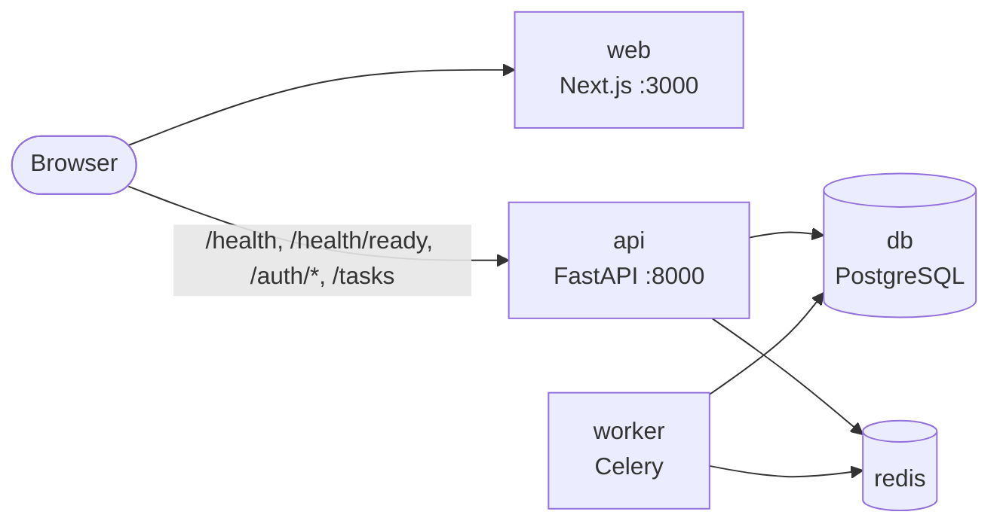
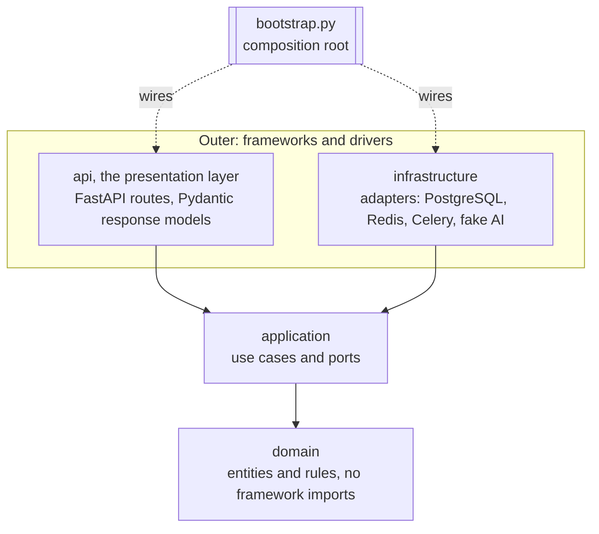
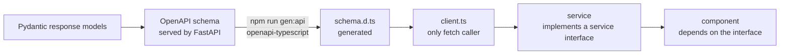
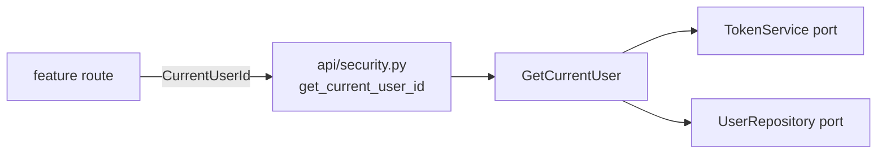

# Architecture

Ballast Tasks is a monorepo with two applications that share one HTTP contract:

- `apps/api`: a FastAPI service plus a Celery worker, built as ports and adapters (Clean Architecture).
- `apps/web`: a Next.js frontend whose components depend on service interfaces, never on the network.

This document is the authority for the rules summarised in [`AGENTS.md`](../AGENTS.md).
The reasons behind the two structural choices are recorded in
[ADR 0001](decisions/0001-monorepo.md) and [ADR 0002](decisions/0002-ports-and-adapters.md).

## System overview



One `docker-compose.yml` at the repo root runs the five services: `db`, `redis`, `api`, `worker`, `web`.
PostgreSQL is the only database, in every environment, including integration tests.

## Layers and the dependency rule

Source code dependencies point inward only. An inner layer never imports an outer one.



| Layer | Contains | May import |
| --- | --- | --- |
| `domain` | Entities, value objects, domain rules | Standard library only |
| `application` | Use cases and the ports in `application/ports/` | `domain` |
| `infrastructure` | Adapters that implement ports | `application`, `domain`, third-party drivers |
| `api` (presentation) | Routes and Pydantic request/response models | `application`, `domain`, FastAPI |
| `bootstrap.py` | Composition root | Everything; nothing imports it except the entry points |

Two more rules sit across the layers:

- `apps/api/src/app/infrastructure/config/settings.py` is the only module that reads environment variables (pydantic-settings, nested groups with `env_nested_delimiter="__"`). Everything else receives typed settings objects.
- `api` (the presentation package) and `infrastructure` never import each other. They meet only through a port, wired in `bootstrap.py`.

The rule is not a convention: it is an import-linter contract in `apps/api`, checked by `uv run lint-imports` (part of `make lint` and of pre-commit). A forbidden import fails the build.

## Ports

Ports are `typing.Protocol` classes in `apps/api/src/app/application/ports/`, one file per port. They are deliberately small: a use case depends on exactly the capability it needs.

```python
class HealthCheck(Protocol):
    """One dependency whose liveness can be probed."""

    @property
    def name(self) -> str: ...          # "database" | "redis" | "ai"; the name shown in /health/ready

    def check(self) -> bool: ...        # True when healthy; must not raise


class JobQueue(Protocol):
    """Hands work to a background worker."""

    def enqueue(self, job_name: str, payload: Mapping[str, object]) -> str: ...   # returns the job id


class LanguageModel(Protocol):
    """A text-completion provider."""

    @property
    def provider(self) -> str: ...      # e.g. "fake"

    @property
    def model(self) -> str: ...         # e.g. "fake-1"

    def complete(self, prompt: str) -> str: ...


class TaskRepository(Protocol):
    """Stores tasks. Returned tasks are detached: a change is stored only by update."""

    async def add(self, task: Task) -> None: ...
    async def get(self, task_id: UUID) -> Task | None: ...
    async def get_for_update(self, task_id: UUID) -> Task | None: ...  # holds the task until the unit of work ends
    async def list(self) -> Sequence[Task]: ...        # newest first
    async def update(self, task: Task) -> None: ...    # raises TaskNotFound
    async def delete(self, task_id: UUID) -> None: ... # raises TaskNotFound
```

The Protocol files are the source of truth for exact signatures; if this section and the code disagree, the code wins and this section is corrected in the same commit.

Adapters in this setup:

| Port | Adapters | Notes |
| --- | --- | --- |
| `HealthCheck` | `database`, `redis`, `ai` | One entry per adapter appears in `GET /health/ready` |
| `JobQueue` | Celery (Redis broker), in-memory fake for unit tests | |
| `LanguageModel` | `fake` only | No real provider SDK and no API key in this setup |
| `TaskRepository` | SQLAlchemy on PostgreSQL, in-memory fake for unit and API tests | Both pass `tests/contract/test_task_repository_contract.py`; the PostgreSQL run is under the `integration` marker |
| `UserRepository` | SQLAlchemy on PostgreSQL, in-memory fake for unit and API tests | Both pass `tests/contract/test_user_repository_contract.py`. `add` raises `EmailAlreadyRegisteredError`, also when a concurrent transaction wins: the unique constraint is the guarantee, and the insert runs in a savepoint so the rest of the unit of work survives the rejection |
| `PasswordHasher` | Argon2id (`argon2-cffi`), reversible fake for tests | Synchronous and CPU-bound; use cases call it through `asyncio.to_thread` |
| `TokenService` | JWT (`PyJWT`, HMAC), in-memory fake for tests | Tokens carry only `sub`, `iat`, `exp`; `decode` raises `InvalidTokenError` |

## Composition roots

There are exactly two places where concrete classes are chosen. No DI framework or container library is used.

### Backend: `apps/api/src/app/bootstrap.py`

- Loads settings once, builds the adapters, and hands them to the use cases and the FastAPI app.
- Holds the registries: a mapping from `AI__PROVIDER` value to `LanguageModel` factory, and the ordered list of `HealthCheck` adapters.
- An unknown `AI__PROVIDER` fails at startup with an explicit error, not at first use.
- Tests build the app through the same function with fakes passed in, so no test patches a module global.

### Unit of work: one transaction per request

Repositories never commit. `Container.request_scope()` (built in `bootstrap.py`) opens one `AsyncSession` from the container's `session_factory`, binds every repository to it, exposes the use cases on top of them as a `RequestScope`, and commits when the block ends normally or rolls back when it raises. The commit/rollback itself is `transactional_session` in `infrastructure/db/unit_of_work.py`, whose module docstring is the authority for this mechanism.

- The HTTP layer enters the scope once per request through `get_request_scope` in `api/dependencies.py`. It is declared with `Depends(..., scope="function")`, so the transaction ends before the response is sent: a commit that fails becomes an error response.
- A new repository is one more field on `RequestScope` and one more argument where the scope is built. Use cases keep receiving ports, never a session. Tasks and users share the scope, so resolving the caller (`GetCurrentUser`) and the task work of one request run in the same transaction.
- Outside HTTP (a Celery job, a script) the same `container.request_scope()` is the unit of work.
- Tables arrive only through Alembic revisions. ORM models live in `infrastructure/db/models/`; importing that package registers them on `Base.metadata`, which has a naming convention so every constraint has a stable name.

### Frontend: `apps/web/src/app/providers.tsx`

- Builds the concrete services (the HTTP-backed ones use `client.ts`; the task services are in-memory for now) and provides them through React context.
- Components and hooks read the service interface from context. They never import `client.ts` or call `fetch`.
- `config.ts` is the only application module that reads `process.env` (`NEXT_PUBLIC_API_URL`). Test tooling (`playwright.config.ts`, `apps/web/visual/`) reads its own variables.
- Tests render components with a fake service passed to the provider; no network mocking is needed.

## HTTP contract flow

The API owns the contract. Frontend types are generated from it, never written by hand.



Rules:

- Any API response change updates the Pydantic model, runs `npm run gen:api`, fixes the frontend types, and lands in the same commit.
- `schema.d.ts` is generated. It is never edited by hand.
- `client.ts` is the only module that calls `fetch`. Services wrap it and return the generated types.

### Pinned health contract

`GET /health` -> always `200`:

```json
{"status": "ok"}
```

`GET /health/ready` -> `200` when every check passes, `503` when any fails; the SAME body shape in both cases:

```json
{
  "status": "ready",
  "checks": [
    {"name": "database", "status": "ok"},
    {"name": "redis", "status": "ok"},
    {"name": "ai", "status": "ok"}
  ],
  "ai": {"provider": "fake", "model": "fake-1"}
}
```

- `status`: `"ready" | "not_ready"`.
- `checks`: ordered list, one entry per registered `HealthCheck`; `name` is the adapter's `name`, `status` is `"ok" | "failed"`. It is a list (not fixed keys) on purpose: adding a check is a new adapter plus one registration line, with no schema or frontend change (open/closed).
- `ai`: static description of the configured `LanguageModel` (`provider`, `model`); the AI's liveness is the `"ai"` entry in `checks`.
- Pydantic model names (these become the OpenAPI component names the frontend types import): `HealthResponse`, `ReadinessResponse`, `ComponentStatus`, `AiInfo`. The `503` response must be declared in the route's `responses=` with the same `ReadinessResponse` model so it appears in OpenAPI.
- Check names are exactly `database`, `redis`, `ai`. The frontend labels them "Database", "Redis", "AI"; "API" status on the page comes from `GET /health`.

### Task contract

Every task route depends on `CurrentUserId` from `api/security.py`, the seam between tasks and authentication: `get_current_user_id` returns the caller's user id (a UUID) or answers `401`. Task routes never see a token, a `User` or the users table.

| Route | Success | Errors |
| --- | --- | --- |
| `POST /tasks` | `201` `TaskResponse` | `401`, `422` |
| `GET /tasks` | `200` `TaskListResponse`: `{"items": [TaskResponse, ...]}`, newest first | `401` |
| `GET /tasks/{task_id}` | `200` `TaskResponse` | `401`, `404`, `422` |
| `PATCH /tasks/{task_id}` | `200` `TaskResponse` | `401`, `404`, `422` |
| `DELETE /tasks/{task_id}` | `204`, no body | `401`, `404`, `422` |

- `TaskResponse`: `id`, `title`, `description`, `status` (`todo | in_progress | done`), `due_date`, `created_by`, `assignee_id`, `created_at`, `updated_at`, `completed_at`.
- `created_by` is the authenticated user; request bodies reject unknown fields, so it cannot be sent.
- `PATCH` is partial: an absent field is left alone, `null` clears `description`, `due_date` and `assignee_id`; `title` and `status` reject `null`. Completing a task is `{"status": "done"}` (the domain sets `completed_at`, and clears it when the task leaves `done`); assigning it is `{"assignee_id": "<user id>"}`.
- The list is an envelope on purpose: pagination can add fields next to `items` without breaking clients.
- Any authenticated user can read and change any task (a shared team list); there is no ownership model.
- Error bodies: `ErrorResponse` (`{"detail": "<message>"}`) for `401` and `404`; FastAPI's `HTTPValidationError` (`{"detail": [{"type", "loc", "msg"}, ...]}`) for `422`, whether a Pydantic model or a domain rule rejected the request. Application and domain errors are mapped to HTTP in `api/errors.py` only. Only a rule broken by the request is a `422`: a stored task the domain rejects is `StoredTaskInvalid`, which is not mapped and so is a `500`.
- Title and description reject the NUL character (PostgreSQL text cannot hold it).
- Concurrent `PATCH`es of one task are serialised: `UpdateTask` loads it with `get_for_update` (`SELECT ... FOR UPDATE`), so the second writer waits and works from what the first one stored. The `tasks` table backs the rule with `CHECK ((status = 'done') = (completed_at IS NOT NULL))`.

## Authentication

Users register and log in under `/auth`; every other feature learns who is calling through one seam and nothing else.



- **The seam**: `apps/api/src/app/api/security.py` exposes `get_current_user_id` and `CurrentUserId = Annotated[uuid.UUID, Depends(get_current_user_id)]`. A feature route asks for `CurrentUserId` and gets a UUID. It never sees a JWT, a `User` or the users table, and its API tests supply a caller with `app.dependency_overrides[get_current_user_id]`.
- **Endpoints**: `POST /auth/register` (`201` `UserResponse`, `409` duplicate email), `POST /auth/login` (OAuth2 password form, so Swagger's Authorize button works; `200` `TokenResponse`), `GET /auth/me` (`200` `UserResponse`). The health endpoints stay public.
- **Errors**: non-validation errors use `ErrorResponse` (`{"detail": "..."}`). Every `401` carries `WWW-Authenticate: Bearer`. Login failures (unknown email, wrong password, inactive user) are one identical `401`, and an unknown email still pays for one hash, so neither body nor timing enumerates accounts. A login password over the 128-character registration maximum is that same `401` before any hashing, for known and unknown emails alike. A bad token and a deactivated or deleted user are likewise one `401`; the user is re-read on every request, so deactivation is immediate.
- **Nothing secret leaves**: `UserResponse` has no hash field; `422` bodies omit pydantic's `input` (for a missing field it is the whole request body, password included); the engine sets `hide_parameters`, so SQL echo under `APP__DEBUG` never prints the bound hash; `AUTH__JWT_SECRET` is a `SecretStr`, and every settings model sets `hide_input_in_errors`, so a startup error names the rejected variable but never echoes its value (a too-short key, a database or Redis URL with a password).
- **Email** is normalised (trimmed, lower-cased) by the `User` entity, so uniqueness is a plain constraint, `uq_users_email`. The use case checks first for a friendly early answer; the constraint, mapped by the repository to `EmailAlreadyRegisteredError`, is what makes concurrent registrations safe.
- **Control characters** (C0, DEL, C1; PostgreSQL text cannot even hold NUL) are refused before any query: `normalise_email` raises `InvalidEmailError`, so login answers its uniform `401`, and `RegisterRequest` rejects them in `full_name` and `password` with `422`.
- **Settings**: the `auth` group (`AUTH__JWT_SECRET`, `AUTH__JWT_ALGORITHM`, `AUTH__ACCESS_TOKEN_EXPIRE_MINUTES`). Startup fails when the secret is missing or shorter than the algorithm's digest (RFC 7518 section 3.2). Only HMAC algorithms are accepted, and decoding pins the configured one, which rules out `alg=none` and algorithm confusion.
- Out of scope by decision: refresh tokens, password reset, email verification, roles.

## SOLID mapping

| Principle | Concrete mechanism | Where it is enforced |
| --- | --- | --- |
| Single responsibility | One module per use case, adapter, route and component; `settings.py` / `config.ts` are the only env readers; `client.ts` is the only fetch caller | Code review; config tests cover the env readers; import-linter keeps concerns in their layer |
| Open/closed | A new provider or backend is a new adapter plus one registry line in `bootstrap.py`; `checks` is a list, so a new health check changes no schema and no frontend code | Registry in `bootstrap.py`; the pinned health contract above |
| Liskov substitution | Every adapter of a port passes the same contract test suite as every other adapter of that port | Contract suites in the API tests, parametrised over all adapters of the port |
| Interface segregation | Small `typing.Protocol` ports (`HealthCheck`, `JobQueue`, `LanguageModel`); small frontend service interfaces; no catch-all interface | `mypy` checks structural conformance; review rejects ports that grow unrelated methods |
| Dependency inversion | Application and UI depend on interfaces; only `bootstrap.py` and `providers.tsx` name concrete classes | import-linter contracts (`uv run lint-imports`); frontend components receive services from context |

## How to add an adapter

Example: a new `LanguageModel` provider. The same steps apply to any port.

1. Write nothing in existing modules yet. Create the adapter's test module and add the new adapter to the port's contract suite parameters. Run the suite and confirm it fails.
2. Implement the adapter in its own module under `infrastructure`. It imports the port's types, never the other way round.
3. Run the port's contract suite until the new adapter passes every case the existing adapters pass.
4. Register it: one line. For a provider that is the `AI__PROVIDER` value -> factory mapping in `infrastructure/ai/registry.py`, which `bootstrap.py` reads; for a health check it is the list in `bootstrap.py`; for a job it is `infrastructure/jobs/tasks.py`.
5. If it needs configuration, add a typed field to the matching group in `settings.py` and a documented line in `.env.example`.
6. Run `make lint` and `make test`, then commit.

No existing adapter, use case, route, schema or frontend file changes. If one must, the port is wrong: stop and revisit the port instead.

## Testing strategy

Tests are written first, seen to fail, then made to pass. A test is never weakened or deleted to get green.

| Kind | What it proves | Needs |
| --- | --- | --- |
| Unit | Use cases and domain rules, with in-memory fakes for every port | Nothing external |
| Contract | Every adapter of a port behaves the same (Liskov) | Fakes run anywhere; real adapters need their service |
| API | Routes, status codes and response shapes (`200`/`503` with the same body), OpenAPI component names | The app built through `bootstrap.py` with fakes |
| Config | `settings.py` parsing: required variables, defaults, nested groups, unknown `AI__PROVIDER` rejected, a rejected secret never echoed in the error | Environment variables only |
| Integration | Real adapters against real PostgreSQL and Redis; `alembic upgrade head` from an empty database yields exactly what the ORM models describe | The running compose stack: `make test-integration`; never SQLite. Database tests work in a throwaway database created next to the configured one (`tests/postgres.py`), so existing data is never touched |

Frontend tests render components with fake services injected through the provider, and test services against a fake client. Coverage is reported by `make test` for both apps.
