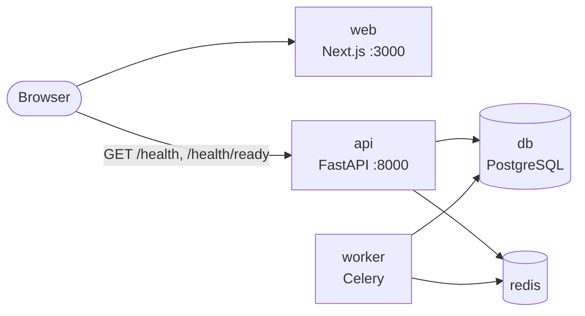
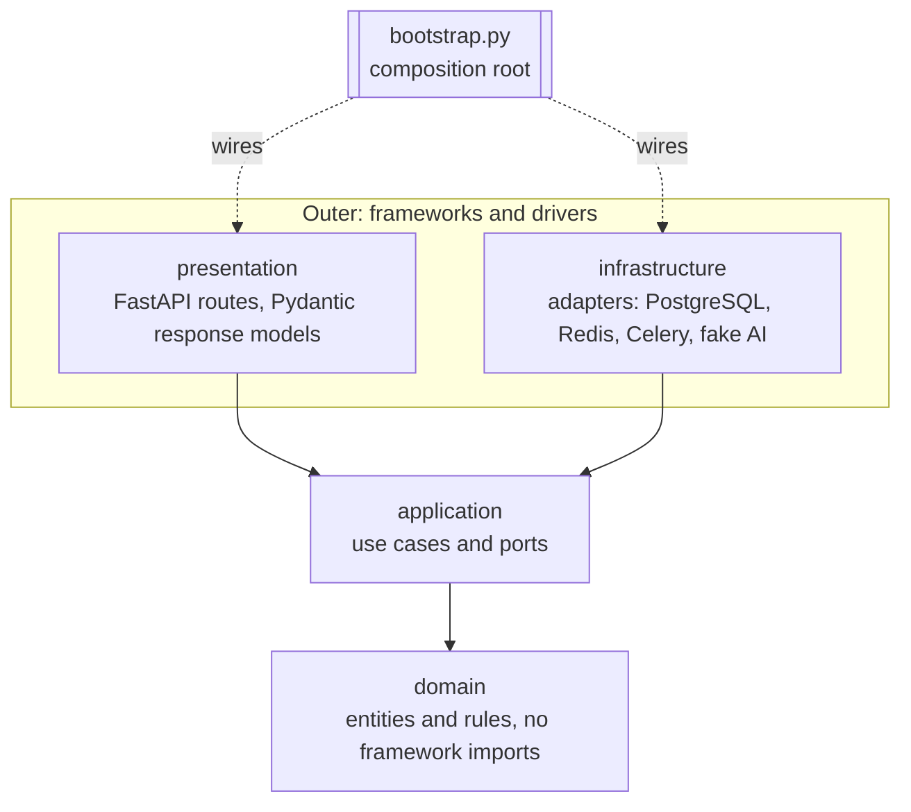
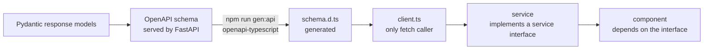

# Architecture

Ballast Tasks is a monorepo with two applications that share one HTTP contract:

- `apps/api`: a FastAPI service plus a Celery worker, built as ports and adapters (Clean Architecture).
- `apps/web`: a Next.js frontend whose components depend on service interfaces, never on the network.

This document is the authority for the rules summarised in [`AGENTS.md`](../AGENTS.md).
The reasons behind the two structural choices are recorded in
[ADR 0001](decisions/0001-monorepo.md) and [ADR 0002](decisions/0002-ports-and-adapters.md).

## System overview



One `docker-compose.yml` at the repo root runs the five services: `db`, `redis`, `api`, `worker`, `web`.
PostgreSQL is the only database, in every environment, including integration tests.

## Layers and the dependency rule

Source code dependencies point inward only. An inner layer never imports an outer one.



| Layer | Contains | May import |
| --- | --- | --- |
| `domain` | Entities, value objects, domain rules | Standard library only |
| `application` | Use cases and the ports in `application/ports/` | `domain` |
| `infrastructure` | Adapters that implement ports | `application`, `domain`, third-party drivers |
| `presentation` | Routes and Pydantic request/response models | `application`, `domain`, FastAPI |
| `bootstrap.py` | Composition root | Everything; nothing imports it except the entry points |

Two more rules sit across the layers:

- `apps/api/src/app/settings.py` is the only module that reads environment variables (pydantic-settings, nested groups with `env_nested_delimiter="__"`). Everything else receives typed settings objects.
- `presentation` and `infrastructure` never import each other. They meet only through a port, wired in `bootstrap.py`.

The rule is not a convention: it is an import-linter contract in `apps/api`, checked by `uv run lint-imports` (part of `make lint` and of pre-commit). A forbidden import fails the build.

## Ports

Ports are `typing.Protocol` classes in `apps/api/src/app/application/ports/`, one file per port. They are deliberately small: a use case depends on exactly the capability it needs.

```python
class HealthCheck(Protocol):
    """One dependency whose liveness can be probed."""

    @property
    def name(self) -> str: ...          # "database" | "redis" | "ai"; the name shown in /health/ready

    def check(self) -> bool: ...        # True when healthy; must not raise


class JobQueue(Protocol):
    """Hands work to a background worker."""

    def enqueue(self, job_name: str, payload: Mapping[str, object]) -> str: ...   # returns the job id


class LanguageModel(Protocol):
    """A text-completion provider."""

    @property
    def provider(self) -> str: ...      # e.g. "fake"

    @property
    def model(self) -> str: ...         # e.g. "fake-1"

    def complete(self, prompt: str) -> str: ...
```

The Protocol files are the source of truth for exact signatures; if this section and the code disagree, the code wins and this section is corrected in the same commit.

Adapters in this setup:

| Port | Adapters | Notes |
| --- | --- | --- |
| `HealthCheck` | `database`, `redis`, `ai` | One entry per adapter appears in `GET /health/ready` |
| `JobQueue` | Celery (Redis broker), in-memory fake for unit tests | |
| `LanguageModel` | `fake` only | No real provider SDK and no API key in this setup |

## Composition roots

There are exactly two places where concrete classes are chosen. No DI framework or container library is used.

### Backend: `apps/api/src/app/bootstrap.py`

- Loads settings once, builds the adapters, and hands them to the use cases and the FastAPI app.
- Holds the registries: a mapping from `AI__PROVIDER` value to `LanguageModel` factory, and the ordered list of `HealthCheck` adapters.
- An unknown `AI__PROVIDER` fails at startup with an explicit error, not at first use.
- Tests build the app through the same function with fakes passed in, so no test patches a module global.

### Frontend: `apps/web/src/app/providers.tsx`

- Builds the concrete services (which use `client.ts`) and provides them through React context.
- Components and hooks read the service interface from context. They never import `client.ts` or call `fetch`.
- `config.ts` is the only module that reads `process.env` (`NEXT_PUBLIC_API_URL`).
- Tests render components with a fake service passed to the provider; no network mocking is needed.

## HTTP contract flow

The API owns the contract. Frontend types are generated from it, never written by hand.



Rules:

- Any API response change updates the Pydantic model, runs `npm run gen:api`, fixes the frontend types, and lands in the same commit.
- `schema.d.ts` is generated. It is never edited by hand.
- `client.ts` is the only module that calls `fetch`. Services wrap it and return the generated types.

### Pinned health contract

`GET /health` -> always `200`:

```json
{"status": "ok"}
```

`GET /health/ready` -> `200` when every check passes, `503` when any fails; the SAME body shape in both cases:

```json
{
  "status": "ready",
  "checks": [
    {"name": "database", "status": "ok"},
    {"name": "redis", "status": "ok"},
    {"name": "ai", "status": "ok"}
  ],
  "ai": {"provider": "fake", "model": "fake-1"}
}
```

- `status`: `"ready" | "not_ready"`.
- `checks`: ordered list, one entry per registered `HealthCheck`; `name` is the adapter's `name`, `status` is `"ok" | "failed"`. It is a list (not fixed keys) on purpose: adding a check is a new adapter plus one registration line, with no schema or frontend change (open/closed).
- `ai`: static description of the configured `LanguageModel` (`provider`, `model`); the AI's liveness is the `"ai"` entry in `checks`.
- Pydantic model names (these become the OpenAPI component names the frontend types import): `HealthResponse`, `ReadinessResponse`, `ComponentStatus`, `AiInfo`. The `503` response must be declared in the route's `responses=` with the same `ReadinessResponse` model so it appears in OpenAPI.
- Check names are exactly `database`, `redis`, `ai`. The frontend labels them "Database", "Redis", "AI"; "API" status on the page comes from `GET /health`.

## SOLID mapping

| Principle | Concrete mechanism | Where it is enforced |
| --- | --- | --- |
| Single responsibility | One module per use case, adapter, route and component; `settings.py` / `config.ts` are the only env readers; `client.ts` is the only fetch caller | Code review; config tests cover the env readers; import-linter keeps concerns in their layer |
| Open/closed | A new provider or backend is a new adapter plus one registry line in `bootstrap.py`; `checks` is a list, so a new health check changes no schema and no frontend code | Registry in `bootstrap.py`; the pinned health contract above |
| Liskov substitution | Every adapter of a port passes the same contract test suite as every other adapter of that port | Contract suites in the API tests, parametrised over all adapters of the port |
| Interface segregation | Small `typing.Protocol` ports (`HealthCheck`, `JobQueue`, `LanguageModel`); small frontend service interfaces; no catch-all interface | `mypy` checks structural conformance; review rejects ports that grow unrelated methods |
| Dependency inversion | Application and UI depend on interfaces; only `bootstrap.py` and `providers.tsx` name concrete classes | import-linter contracts (`uv run lint-imports`); frontend components receive services from context |

## How to add an adapter

Example: a new `LanguageModel` provider. The same steps apply to any port.

1. Write nothing in existing modules yet. Create the adapter's test module and add the new adapter to the port's contract suite parameters. Run the suite and confirm it fails.
2. Implement the adapter in its own module under `infrastructure`. It imports the port's types, never the other way round.
3. Run the port's contract suite until the new adapter passes every case the existing adapters pass.
4. Register it: one line in the registry in `bootstrap.py` (for a provider, the `AI__PROVIDER` value -> factory).
5. If it needs configuration, add a typed field to the matching group in `settings.py` and a documented line in `.env.example`.
6. Run `make lint` and `make test`, then commit.

No existing adapter, use case, route, schema or frontend file changes. If one must, the port is wrong: stop and revisit the port instead.

## Testing strategy

Tests are written first, seen to fail, then made to pass. A test is never weakened or deleted to get green.

| Kind | What it proves | Needs |
| --- | --- | --- |
| Unit | Use cases and domain rules, with in-memory fakes for every port | Nothing external |
| Contract | Every adapter of a port behaves the same (Liskov) | Fakes run anywhere; real adapters need their service |
| API | Routes, status codes and response shapes (`200`/`503` with the same body), OpenAPI component names | The app built through `bootstrap.py` with fakes |
| Config | `settings.py` parsing: required variables, defaults, nested groups, unknown `AI__PROVIDER` rejected | Environment variables only |
| Integration | Real adapters against real PostgreSQL and Redis | Containers of the official images; never SQLite |

Frontend tests render components with fake services injected through the provider, and test services against a fake client. Coverage is reported by `make test` for both apps.
