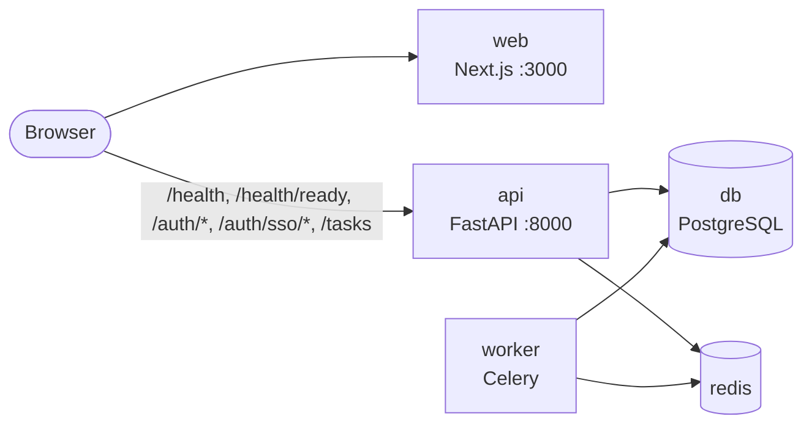
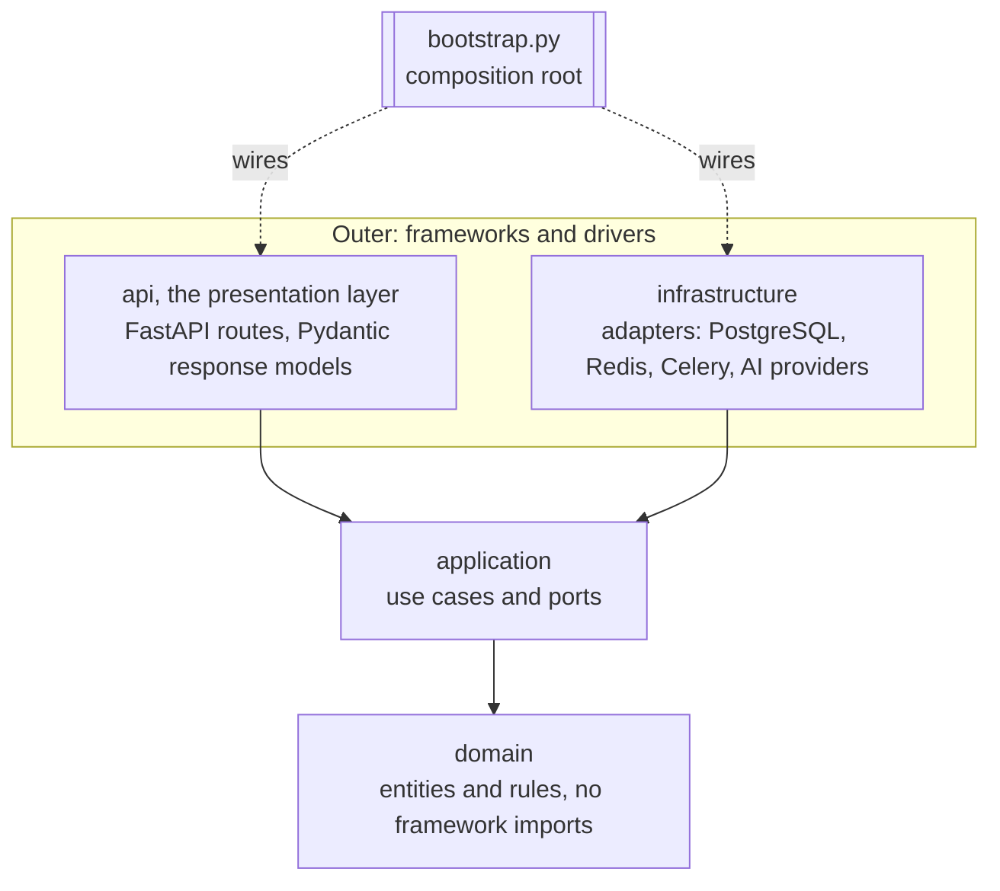
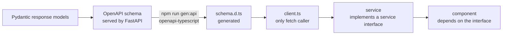
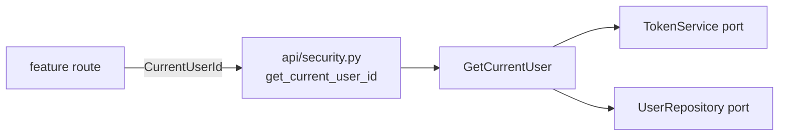

# Architecture

Ballast Tasks is a monorepo with two applications that share one HTTP contract:

- `apps/api`: a FastAPI service plus a Celery worker, built as ports and adapters (Clean Architecture).
- `apps/web`: a Next.js frontend whose components depend on service interfaces, never on the network.

This document is the authority for the rules summarised in [`AGENTS.md`](../AGENTS.md).
The reasons behind the two structural choices are recorded in
[ADR 0001](decisions/0001-monorepo.md) and [ADR 0002](decisions/0002-ports-and-adapters.md);
single sign-on is [ADR 0006](decisions/0006-single-sign-on.md).

## System overview



One `docker-compose.yml` at the repo root runs the five services: `db`, `redis`, `api`, `worker`, `web`.
PostgreSQL is the only database, in every environment, including integration tests.

## Layers and the dependency rule

Source code dependencies point inward only. An inner layer never imports an outer one.



| Layer | Contains | May import |
| --- | --- | --- |
| `domain` | Entities, value objects, domain rules | Standard library only |
| `application` | Use cases and the ports in `application/ports/` | `domain` |
| `infrastructure` | Adapters that implement ports | `application`, `domain`, third-party drivers |
| `api` (presentation) | Routes and Pydantic request/response models | `application`, `domain`, FastAPI |
| `bootstrap.py` | Composition root | Everything; nothing imports it except the entry points |

Two more rules sit across the layers:

- `apps/api/src/app/infrastructure/config/settings.py` is the only module that reads environment variables (pydantic-settings, nested groups with `env_nested_delimiter="__"`). Everything else receives typed settings objects.
- `api` (the presentation package) and `infrastructure` never import each other. They meet only through a port, wired in `bootstrap.py`.

The rule is not a convention: it is an import-linter contract in `apps/api`, checked by `uv run lint-imports` (part of `make lint` and of pre-commit). A forbidden import fails the build.

## Ports

Ports are `typing.Protocol` classes in `apps/api/src/app/application/ports/`, one file per port. They are deliberately small: a use case depends on exactly the capability it needs.

```python
class HealthCheck(Protocol):
    """One dependency whose liveness can be probed."""

    @property
    def name(self) -> str: ...          # "database" | "redis" | "ai"; the name shown in /health/ready

    def check(self) -> bool: ...        # True when healthy; must not raise


class JobQueue(Protocol):
    """Hands work to a background worker."""

    def enqueue(self, job_name: str, payload: Mapping[str, object]) -> str: ...   # returns the job id


class LanguageModel(Protocol):
    """A text-completion provider."""

    @property
    def provider(self) -> str: ...      # e.g. "fake"

    @property
    def model(self) -> str: ...         # e.g. "fake-1"

    async def generate(self, prompt: str) -> str: ...   # non-empty text, or a LanguageModelError
    async def check(self) -> bool: ...                  # never raises, never spends tokens


class TaskRepository(Protocol):
    """Stores tasks. Returned tasks are detached: a change is stored only by update."""

    async def add(self, task: Task) -> None: ...       # raises InvalidAssigneeError
    async def get(self, task_id: UUID) -> Task | None: ...
    async def get_for_update(self, task_id: UUID) -> Task | None: ...  # holds the task until the unit of work ends
    async def list(self) -> Sequence[Task]: ...        # newest first
    async def update(self, task: Task) -> None: ...    # raises TaskNotFound, InvalidAssigneeError
    async def delete(self, task_id: UUID) -> None: ... # raises TaskNotFound


class RateLimiter(Protocol):
    """Counts hits per key; atomic, so concurrent hits never exceed the policy's limit."""

    async def hit(self, key: str, policy: RateLimitPolicy) -> RateLimitDecision: ...
    # policy: name, limit, window_seconds; decision: allowed, limit, remaining, reset_after_seconds


class UserDirectory(Protocol):
    """The one thing the task use cases may ask about users."""

    async def is_active_user(self, user_id: UUID) -> bool: ...  # unknown and inactive are both False


class IdentityProvider(Protocol):
    """An external identity provider, driven with the authorization-code flow."""

    @property
    def name(self) -> str: ...          # "google" | "fake": the URL segment and the stored provider key

    async def authorization_url(self, *, state: str, nonce: str, redirect_uri: str) -> str: ...
    async def exchange(self, *, code: str, redirect_uri: str, nonce: str) -> VerifiedIdentity: ...
    # VerifiedIdentity: provider, subject, email, email_verified, full_name
    # raises IdentityCodeRejectedError, IdentityProviderUnavailableError


class UserIdentityRepository(Protocol):
    async def find_user_id(self, provider: str, subject: str) -> UUID | None: ...
    async def link(self, user_id: UUID, provider: str, subject: str, *, linked_at: datetime) -> None: ...
    # raises IdentityAlreadyLinkedError


class OneTimeStore(Protocol):
    """Short-lived values that can be read exactly once."""

    async def put(self, key: str, value: str, *, ttl: timedelta) -> None: ...
    async def take(self, key: str) -> str | None: ...   # atomic read-and-delete
```

The Protocol files are the source of truth for exact signatures; if this section and the code disagree, the code wins and this section is corrected in the same commit.

Adapters in this setup:

| Port | Adapters | Notes |
| --- | --- | --- |
| `HealthCheck` | `database`, `redis`, `ai` | One entry per adapter appears in `GET /health/ready` |
| `JobQueue` | Celery (Redis broker), in-memory fake for unit tests | |
| `LanguageModel` | `fake` (default, offline), `openrouter`, `gemini` | The real ones are plain `httpx`, no vendor SDK ([ADR 0003](decisions/0003-llm-adapters-over-http.md)). All three pass `tests/contract/test_language_model_contract.py`; the real ones run it against a stubbed transport |
| `TaskRepository` | SQLAlchemy on PostgreSQL, in-memory fake for unit and API tests | Both pass `tests/contract/test_task_repository_contract.py`; the PostgreSQL run is under the `integration` marker. `add` and `update` raise `InvalidAssigneeError` when the assignee is not a stored user: the foreign key is the guarantee, and the write runs in a savepoint so the rest of the unit of work survives the rejection |
| `UserDirectory` | SQLAlchemy on PostgreSQL (`SELECT EXISTS`, no row loaded), in-memory fake over the users fake | Both pass `tests/contract/test_user_directory_contract.py`. It is how `CreateTask` and `UpdateTask` validate an assignee without importing an auth use case or the `UserRepository` |
| `UserRepository` | SQLAlchemy on PostgreSQL, in-memory fake for unit and API tests | Both pass `tests/contract/test_user_repository_contract.py`. `add` raises `EmailAlreadyRegisteredError`, also when a concurrent transaction wins: the unique constraint is the guarantee, and the insert runs in a savepoint so the rest of the unit of work survives the rejection |
| `PasswordHasher` | Argon2id (`argon2-cffi`), reversible fake for tests | Synchronous and CPU-bound; use cases call it through `asyncio.to_thread` |
| `RateLimiter` | Redis (one Lua script per hit), in-memory, and `FailOpenRateLimiter`, which wraps the first with the second | All three pass `tests/contract/test_rate_limiter_contract.py`; the Redis run is under the `integration` marker. The in-memory adapter serves the tests and stands in while Redis is unreachable |
| `TokenService` | JWT (`PyJWT`, HMAC), in-memory fake for tests | Tokens carry only `sub`, `iat`, `exp`; `decode` raises `InvalidTokenError` |
| `IdentityProvider` | `google` (`httpx`, OpenID Connect with discovery, ID token verified with `PyJWT` against Google's cached keys), `fake` (no credentials; tests and local demos, refused when `APP__ENV=production`) | Both pass `tests/contract/test_identity_provider_contract.py`; Google runs against a stand-in Google (`httpx.MockTransport`, local signing keys). Registered in `infrastructure/identity/registry.py`, switched on by `SSO__ENABLED_PROVIDERS`; each factory names the variable it misses and stops startup |
| `UserIdentityRepository` | SQLAlchemy on PostgreSQL, in-memory fake | Both pass `tests/contract/test_user_identity_repository_contract.py`. `link` raises `IdentityAlreadyLinkedError`, also when a concurrent transaction wins: the two unique constraints are the guarantee, in a savepoint |
| `OneTimeStore` | Redis (`SET PX` / `GETDEL`), in-memory fake with a clock | Both pass `tests/contract/test_one_time_store_contract.py`. Holds the state of a sign-in and the one-time exchange code, keyed by SHA-256 digests |

## Composition roots

There are exactly two places where concrete classes are chosen. No DI framework or container library is used.

### Backend: `apps/api/src/app/bootstrap.py`

- Loads settings once, builds the adapters, and hands them to the use cases and the FastAPI app.
- Reads the provider registry (`AI__PROVIDER` value -> `LanguageModel` factory, in `infrastructure/ai/registry.py`) and holds the ordered list of `HealthCheck` adapters. The identity provider registry (name -> `IdentityProvider` factory, in `infrastructure/identity/registry.py`) is read the same way; `SSO__ENABLED_PROVIDERS` picks from it.
- An unknown `AI__PROVIDER` fails at startup with an explicit error, not at first use.
- Tests build the app through the same function with fakes passed in, so no test patches a module global.

### Unit of work: one transaction per request

Repositories never commit. `Container.request_scope()` (built in `bootstrap.py`) opens one `AsyncSession` from the container's `session_factory`, binds every repository to it, exposes the use cases on top of them as a `RequestScope`, and commits when the block ends normally or rolls back when it raises. The commit/rollback itself is `transactional_session` in `infrastructure/db/unit_of_work.py`, whose module docstring is the authority for this mechanism.

- The HTTP layer enters the scope once per request through `get_request_scope` in `api/dependencies.py`. It is declared with `Depends(..., scope="function")`, so the transaction ends before the response is sent: a commit that fails becomes an error response.
- A new repository is one more field on `RequestScope` and one more argument where the scope is built. Use cases keep receiving ports, never a session. Tasks and users share the scope, so resolving the caller (`GetCurrentUser`) and the task work of one request run in the same transaction.
- Outside HTTP (a Celery job, a script) the same `container.request_scope()` is the unit of work.
- Tables arrive only through Alembic revisions. ORM models live in `infrastructure/db/models/`; importing that package registers them on `Base.metadata`, which has a naming convention so every constraint has a stable name.

### Frontend: `apps/web/src/app/providers.tsx`

- Builds the concrete services (the HTTP-backed ones use `client.ts`; the task services are in-memory for now) and provides them through React context.
- Components and hooks read the service interface from context. They never import `client.ts` or call `fetch`.
- `config.ts` is the only application module that reads `process.env` (`NEXT_PUBLIC_API_URL`). Test tooling (`playwright.config.ts`, `apps/web/visual/`) reads its own variables.
- Tests render components with a fake service passed to the provider; no network mocking is needed.

## HTTP contract flow

The API owns the contract. Frontend types are generated from it, never written by hand.



Rules:

- Any API response change updates the Pydantic model, runs `npm run gen:api`, fixes the frontend types, and lands in the same commit.
- `schema.d.ts` is generated. It is never edited by hand.
- `client.ts` is the only module that calls `fetch`. Services wrap it and return the generated types.

### Pinned health contract

`GET /health` -> always `200`:

```json
{"status": "ok"}
```

`GET /health/ready` -> `200` when every check passes, `503` when any fails; the SAME body shape in both cases:

```json
{
  "status": "ready",
  "checks": [
    {"name": "database", "status": "ok"},
    {"name": "redis", "status": "ok"},
    {"name": "ai", "status": "ok"}
  ],
  "ai": {"provider": "fake", "model": "fake-1"}
}
```

- `status`: `"ready" | "not_ready"`.
- `checks`: ordered list, one entry per registered `HealthCheck`; `name` is the adapter's `name`, `status` is `"ok" | "failed"`. It is a list (not fixed keys) on purpose: adding a check is a new adapter plus one registration line, with no schema or frontend change (open/closed).
- `ai`: static description of the configured `LanguageModel` (`provider`, `model`); the AI's liveness is the `"ai"` entry in `checks`.
- Pydantic model names (these become the OpenAPI component names the frontend types import): `HealthResponse`, `ReadinessResponse`, `ComponentStatus`, `AiInfo`. The `503` response must be declared in the route's `responses=` with the same `ReadinessResponse` model so it appears in OpenAPI.
- Check names are exactly `database`, `redis`, `ai`. The frontend labels them "Database", "Redis", "AI"; "API" status on the page comes from `GET /health`.

### Task contract

Every task route depends on `CurrentUserId` from `api/security.py`, the seam between tasks and authentication: `get_current_user_id` returns the caller's user id (a UUID) or answers `401`. Task routes never see a token, a `User` or the users table.

| Route | Success | Errors |
| --- | --- | --- |
| `POST /tasks` | `201` `TaskResponse` | `401`, `422` (also: assignee is not an active user) |
| `GET /tasks` | `200` `TaskListResponse`: `{"items": [TaskResponse, ...]}`, newest first | `401` |
| `GET /tasks/{task_id}` | `200` `TaskResponse` | `401`, `404`, `422` |
| `PATCH /tasks/{task_id}` | `200` `TaskResponse` | `401`, `404`, `422` (also: the assignee changes to somebody who is not an active user) |
| `DELETE /tasks/{task_id}` | `204`, no body | `401`, `404`, `422` |

- `TaskResponse`: `id`, `title`, `description`, `status` (`todo | in_progress | done`), `due_date`, `created_by`, `assignee_id`, `created_at`, `updated_at`, `completed_at`.
- `created_by` is the authenticated user; request bodies reject unknown fields, so it cannot be sent.
- `PATCH` is partial: an absent field is left alone, `null` clears `description`, `due_date` and `assignee_id`; `title` and `status` reject `null`. Completing a task is `{"status": "done"}` (the domain sets `completed_at`, and clears it when the task leaves `done`); assigning it is `{"assignee_id": "<user id>"}`.
- **Assignee**: an `assignee_id` that `POST` sets or `PATCH` changes must be an active user. Otherwise the answer is `422` with `{"type": "invalid_assignee", "loc": ["body", "assignee_id"], "msg": "assignee_id must be the id of an active user"}`, the same body for an unknown id and for a deactivated user. `CreateTask` and `UpdateTask` ask the `UserDirectory` port; the foreign key below is the race-safe backstop, and the repository maps its violation to the same `InvalidAssigneeError`, so a user who vanishes between the check and the write is still a `422`, never a `500`. `PATCH` checks the assignee only when the assignment changes: a body that names the `assignee_id` the task already has is accepted even if that user has since been deactivated (a form that saves the whole task sends it back), while a body that changes the assignee to an unknown or inactive user is the `422` above. So a task whose assignee was deactivated later can still be edited, completed or reassigned.
- The list is an envelope on purpose: pagination can add fields next to `items` without breaking clients.
- Any authenticated user can read and change any task (a shared team list); there is no ownership model.
- Error bodies: `ErrorResponse` (`{"detail": "<message>"}`) for `401` and `404`; FastAPI's `HTTPValidationError` (`{"detail": [{"type", "loc", "msg"}, ...]}`) for `422`, whether a Pydantic model or a domain rule rejected the request. Application and domain errors are mapped to HTTP in `api/errors.py` only. Only a rule broken by the request is a `422`: a stored task the domain rejects is `StoredTaskInvalid`, which is not mapped and so is a `500`.
- Title and description reject the NUL character (PostgreSQL text cannot hold it).
- Concurrent `PATCH`es of one task are serialised: `UpdateTask` loads it with `get_for_update` (`SELECT ... FOR UPDATE`), so the second writer waits and works from what the first one stored. The `tasks` table backs the rule with `CHECK ((status = 'done') = (completed_at IS NOT NULL))`.

### Tasks reference users

Two foreign keys to `users.id`, both indexed, each with a deliberate `ON DELETE` (revision `fa7b13ec7508`, whose docstring is the authority):

| Column | `ON DELETE` | Why |
| --- | --- | --- |
| `tasks.created_by` (`fk_tasks_created_by_users`) | `RESTRICT` | A task must not silently lose its creator: a user who created tasks cannot be deleted, only deactivated |
| `tasks.assignee_id` (`fk_tasks_assignee_id_users`) | `SET NULL` | When an assignee goes away the task stays and becomes unassigned |

The revision also upgrades a database that already holds tasks written while both columns were unchecked UUIDs. No task is deleted and the upgrade does not fail: an `assignee_id` that matches no user becomes `NULL` (what `SET NULL` would have done); a `created_by` that matches no user keeps its id, and an inactive placeholder user (`unknown-<id>@placeholder.invalid`, a hash no password matches) is inserted under that id, so `GET /tasks` answers what it did before. `downgrade` removes those placeholders again. Proven in `tests/integration/test_tasks_users_migration.py`.

## Authentication

Users register and log in under `/auth`; every other feature learns who is calling through one seam and nothing else.



- **The seam**: `apps/api/src/app/api/security.py` exposes `get_current_user_id` and `CurrentUserId = Annotated[uuid.UUID, Depends(get_current_user_id)]`. A feature route asks for `CurrentUserId` and gets a UUID. It never sees a JWT, a `User` or the users table, and its API tests supply a caller with `app.dependency_overrides[get_current_user_id]`.
- **Endpoints**: `POST /auth/register` (`201` `UserResponse`, `409` duplicate email), `POST /auth/login` (OAuth2 password form, so Swagger's Authorize button works; `200` `TokenResponse`), `GET /auth/me` (`200` `UserResponse`). The health endpoints stay public.
- **Errors**: non-validation errors use `ErrorResponse` (`{"detail": "..."}`). Every `401` carries `WWW-Authenticate: Bearer`. Login failures (unknown email, wrong password, inactive user) are one identical `401`, and an unknown email still pays for one hash, so neither body nor timing enumerates accounts. A login password over the 128-character registration maximum is that same `401` before any hashing, for known and unknown emails alike. A bad token and a deactivated or deleted user are likewise one `401`; the user is re-read on every request, so deactivation is immediate.
- **Nothing secret leaves**: `UserResponse` has no hash field; `422` bodies omit pydantic's `input` (for a missing field it is the whole request body, password included); the engine sets `hide_parameters`, so SQL echo under `APP__DEBUG` never prints the bound hash; `AUTH__JWT_SECRET` is a `SecretStr`, and every settings model sets `hide_input_in_errors`, so a startup error names the rejected variable but never echoes its value (a too-short key, a database or Redis URL with a password).
- **Email** is normalised (trimmed, lower-cased) by the `User` entity, so uniqueness is a plain constraint, `uq_users_email`. The use case checks first for a friendly early answer; the constraint, mapped by the repository to `EmailAlreadyRegisteredError`, is what makes concurrent registrations safe.
- **Control characters** (C0, DEL, C1; PostgreSQL text cannot even hold NUL) are refused before any query: `normalise_email` raises `InvalidEmailError`, so login answers its uniform `401`, and `RegisterRequest` rejects them in `full_name` and `password` with `422`.
- **Settings**: the `auth` group (`AUTH__JWT_SECRET`, `AUTH__JWT_ALGORITHM`, `AUTH__ACCESS_TOKEN_EXPIRE_MINUTES`). Startup fails when the secret is missing or shorter than the algorithm's digest (RFC 7518 section 3.2). Only HMAC algorithms are accepted, and decoding pins the configured one, which rules out `alg=none` and algorithm confusion.
- Out of scope by decision: refresh tokens, password reset, email verification, roles.

### Single sign-on

A second way in, next to password login; the reasons, the flow diagram and the threats considered are in [ADR 0006](decisions/0006-single-sign-on.md). It ends in the same access token, so nothing behind `CurrentUserId` knows it exists.

| Route | Success | Errors |
| --- | --- | --- |
| `GET /auth/sso/providers` | `200` `SsoProvidersResponse`: `{"providers": [{"name": "google"}]}`, empty while disabled | |
| `GET /auth/sso/{provider}/start` | `303` to the provider, plus the `sso_binding` cookie (HttpOnly, SameSite=Lax, `Path=/auth/sso`, 5 minutes) | `404` unknown or disabled provider |
| `GET /auth/sso/{provider}/callback` | `303` to `SSO__WEB_CALLBACK_URL?code=<one-time code>` | `303` to `SSO__WEB_CALLBACK_URL?error=sso_failed` (or `provider_unavailable`) for every failure; `404` unknown or disabled provider |
| `POST /auth/sso/exchange` `{"code": "..."}` | `200` `TokenResponse`, the body of `POST /auth/login` | `401` for every failure, `422` |

- **Use cases**: `StartSsoSignIn` (state, nonce and browser binding into the `OneTimeStore`), `CompleteSsoSignIn` (spends the state, asks the `IdentityProvider`, runs `SignInWithIdentity`, issues the exchange code), `SignInWithIdentity` (find by `(provider, subject)`, else link by VERIFIED email, else create with no password; unverified emails and inactive users are refused), `RedeemSsoCode` (code -> access token, once).
- **Rate limiting**: the callback and the exchange present a credential and spend the strict `auth` budget by client IP, like login; listing providers and starting a flow spend the general one. Every route declares the `429`.
- **Redirect targets come from settings only**: `SSO__API_PUBLIC_BASE_URL` (the provider's `redirect_uri` is this plus the callback route's path) and `SSO__WEB_CALLBACK_URL`. Nothing in a request can name another.
- **The access token never travels in a URL**: the callback redirects with a one-time code (single use, 60 seconds), and the web app swaps it with a `POST`.
- **Users without a password**: `users.hashed_password` is nullable; a user created by single sign-on has none and password login answers them its uniform `401`. Identities live in `user_identities` (unique `(provider, subject)`, unique `(user_id, provider)`, `ON DELETE CASCADE`).
- **Settings**: the `sso` group (`SSO__ENABLED_PROVIDERS`, `SSO__GOOGLE_CLIENT_ID`, `SSO__GOOGLE_CLIENT_SECRET` as a `SecretStr`, `SSO__API_PUBLIC_BASE_URL`, `SSO__WEB_CALLBACK_URL`). Disabled by default, so `docker compose up` needs no credentials.

## Rate limiting

Decision, algorithm and limits of the protection: [ADR 0004](decisions/0004-rate-limiting.md).

- **Opt-in per router or route**, through one of two dependencies in `api/rate_limit.py`: `limit_auth_attempts` (`POST /auth/login` and `POST /auth/register`, the strict `auth` policy, keyed by client IP) and `limit_requests` (everything else: the `authenticated` policy keyed by user id when the token resolves to a user, otherwise the `anonymous` policy keyed by client IP). A route without one is not limited: `GET /health` and `GET /health/ready`. A new router adds the dependency and `responses={**TOO_MANY_REQUESTS}`.
- **Contract**: over the limit is `429` `ErrorResponse` with `Retry-After`; every response of a limited route (errors too) carries `X-RateLimit-Limit`, `X-RateLimit-Remaining` and `X-RateLimit-Reset` (seconds from now). The limiter runs first, so `429` wins over `401` and `422`.
- **Who is calling**: `get_optional_user_id` in `api/security.py` (same seam, same per-request resolution as `CurrentUserId`, but `None` instead of a `401`). Client IP is the connection's peer; `X-Forwarded-For` (last entry) only with `RATE_LIMIT__TRUST_PROXY=true`.
- **Wiring**: `bootstrap.py` builds `Container.rate_limiting` (the limiter plus the three policies and flags from the `rate_limit` settings group); the API reads it through the `RateLimiting` Protocol in `api/dependencies.py`. API tests replace the limiter with the in-memory adapter on a clock they move.
- **Redis down**: the API keeps serving and counts per process; one warning per outage (`FailOpenRateLimiter`).

## SOLID mapping

| Principle | Concrete mechanism | Where it is enforced |
| --- | --- | --- |
| Single responsibility | One module per use case, adapter, route and component; `settings.py` / `config.ts` are the only env readers; `client.ts` is the only fetch caller | Code review; config tests cover the env readers; import-linter keeps concerns in their layer |
| Open/closed | A new provider or backend is a new adapter plus one registry line (`infrastructure/ai/registry.py` for a provider); `checks` is a list, so a new health check changes no schema and no frontend code | `AI_PROVIDERS` in `infrastructure/ai/registry.py`, read by `bootstrap.py`; the pinned health contract above |
| Liskov substitution | Every adapter of a port passes the same contract test suite as every other adapter of that port | Contract suites in the API tests, parametrised over all adapters of the port |
| Interface segregation | Small `typing.Protocol` ports (`HealthCheck`, `JobQueue`, `LanguageModel`); small frontend service interfaces; no catch-all interface | `mypy` checks structural conformance; review rejects ports that grow unrelated methods |
| Dependency inversion | Application and UI depend on interfaces; only `bootstrap.py` and `providers.tsx` name concrete classes | import-linter contracts (`uv run lint-imports`); frontend components receive services from context |

## How to add an adapter

Example: a new `LanguageModel` provider. The same steps apply to any port.

1. Write nothing in existing modules yet. Create the adapter's test module and add the new adapter to the port's contract suite parameters. Run the suite and confirm it fails.
2. Implement the adapter in its own module under `infrastructure`. It imports the port's types, never the other way round.
3. Run the port's contract suite until the new adapter passes every case the existing adapters pass.
4. Register it: one line. For a provider that is the `AI__PROVIDER` value -> factory mapping in `infrastructure/ai/registry.py`, which `bootstrap.py` reads (an identity provider: the name -> factory mapping in `infrastructure/identity/registry.py`); for a health check it is the list in `bootstrap.py`; for a job it is `infrastructure/jobs/tasks.py`.
5. If it needs configuration, add a typed field to the matching group in `settings.py` and a documented line in `.env.example`.
6. Run `make lint` and `make test`, then commit.

No existing adapter, use case, route, schema or frontend file changes. If one must, the port is wrong: stop and revisit the port instead.

### Worked example: the OpenRouter and Gemini providers

Both real `LanguageModel` adapters arrived by those six steps.

1. Tests first: `tests/unit/test_openrouter_language_model.py` and `tests/unit/test_gemini_language_model.py`, plus one factory line each in `ADAPTERS` of the contract suite. They run against `httpx.MockTransport` fed with response bodies copied from the providers' references (`tests/ai_stubs.py`), so they need neither network nor key. They were committed failing.
2. `infrastructure/ai/openrouter.py` and `infrastructure/ai/gemini.py`, each on the shared helpers in `infrastructure/ai/http.py`.
3. The contract suite passes for `fake`, `openrouter` and `gemini` alike.
4. One line each in `AI_PROVIDERS`: `"openrouter": _over_http(OpenRouterLanguageModel)` and `"gemini": _over_http(GeminiLanguageModel)`.
5. `AI__API_KEY`, `AI__BASE_URL`, `AI__TIMEOUT_SECONDS` and `AI__CHECK_CACHE_SECONDS` joined the `ai` group. They are provider-neutral, so a third HTTP provider needs no new setting.
6. Checks, then commit.

What changed in `apps/api/src` outside `infrastructure/ai/`: the `ai` settings group; the client lifetime in `bootstrap.py` (one `httpx.AsyncClient`, created in `build_container`, closed by `Container.aclose`); and the typed errors next to the port. No use case, route, schema or frontend file changed, and switching provider is an edit to `.env`.

- **Typed failures**: `generate` raises only subclasses of `LanguageModelError`, defined next to the port in `application/ports/language_model.py`: `LanguageModelUnavailableError`, `LanguageModelRateLimitedError`, `LanguageModelAuthenticationError`, `LanguageModelInvalidResponseError`, `LanguageModelTimeoutError`. The mapping from HTTP statuses and transport errors is `error_for_status` and `send` in `infrastructure/ai/http.py`. import-linter forbids `httpx` in `domain`, `application` and `api`.
- **`check()` is free**: OpenRouter reads `GET /key` (the public models listing would accept any key); Gemini reads the model resource, `GET /models/{id}`. Neither generates. Both have 2 seconds in total and return `False` instead of raising. `GET /health/ready` is public, so `LanguageModelHealthCheck` reuses the result (a failure too) for `AI__CHECK_CACHE_SECONDS` (default 30): the provider is asked at most once per window.
- **Timeout**: `AI__TIMEOUT_SECONDS` is a total deadline for one generation, enforced in `send`; the `httpx` per-phase timeouts are the same value.
- **The key**: `AI__API_KEY` is a `SecretStr`. Needing it is the rule of the HTTP factory in the registry (`_over_http`), not of `settings.py`, so a keyless provider is still one registry line; `build_container` runs the factory, so a missing key stops startup with a message naming the variable. Adapter errors carry a status code or a fixed phrase, never a header or a response body. Gemini receives the key in the `x-goog-api-key` header, not the `?key=` query, so it cannot appear in a logged URL.
- **Live tests**: `uv run pytest -m live` calls the real provider named by `AI__PROVIDER` with `AI__API_KEY`. They are deselected by default and skipped without a key.

## Testing strategy

Tests are written first, seen to fail, then made to pass. A test is never weakened or deleted to get green.

| Kind | What it proves | Needs |
| --- | --- | --- |
| Unit | Use cases and domain rules, with in-memory fakes for every port | Nothing external |
| Contract | Every adapter of a port behaves the same (Liskov) | Fakes run anywhere; real adapters need their service |
| API | Routes, status codes and response shapes (`200`/`503` with the same body), OpenAPI component names | The app built through `bootstrap.py` with fakes |
| Config | `settings.py` parsing: required variables, defaults, nested groups, unknown `AI__PROVIDER` rejected, a rejected secret never echoed in the error | Environment variables only |
| Live | A real third party answers as the adapter expects: the AI provider accepts the key and generates text; Google's discovery and token endpoints have the shape the sign-in adapter reads | Opt-in: `uv run pytest -m live` with `AI__PROVIDER` and `AI__API_KEY`, or `SSO__GOOGLE_CLIENT_ID` and `SSO__GOOGLE_CLIENT_SECRET`; deselected by default, skipped without credentials |
| Integration | Real adapters against real PostgreSQL and Redis; `alembic upgrade head` from an empty database yields exactly what the ORM models describe, and from a database that already holds tasks it keeps every row; the task routes driven end to end with a bearer token obtained through register and login (`tests/integration/test_tasks_api.py`); the single sign-on browser flow over real HTTP against a uvicorn server, with the fake provider (`tests/integration/test_sso_flow.py`) | The running compose stack: `make test-integration`; never SQLite. Database tests work in a throwaway database created next to the configured one (`tests/postgres.py`), so existing data is never touched |

Frontend tests render components with fake services injected through the provider, and test services against a fake client. Coverage is reported by `make test` for both apps.
