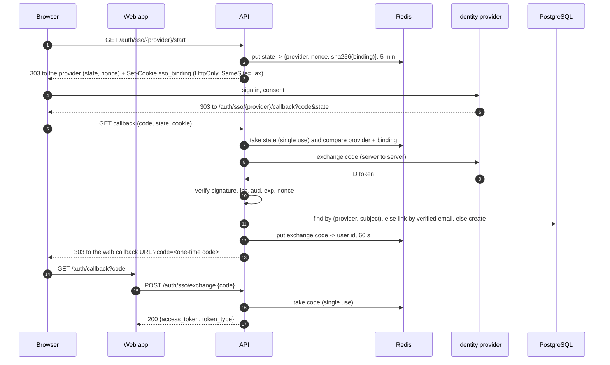

# ADR 0006: Single sign-on behind an `IdentityProvider` port, Google first

- Status: Accepted
- Date: 2026-09-18

## Context

Users have to be able to sign up and sign in without the application keeping a password for them, and the application must not care which identity provider vouches for them.
Google is the first provider; others may follow.
The exercise requires JWT authentication, so single sign-on does not replace it: whatever proves who the person is, the API ends up issuing the same access token, and nothing downstream of `CurrentUserId` changes.
Password login stays, so a reviewer can use seeded demo credentials without a Google account, and `docker compose up` must keep working with no credentials at all.

## Decision

### A port, a registry, and providers enabled by name

- `application/ports/identity_provider.py`: `IdentityProvider` (`name`, `authorization_url(state, nonce, redirect_uri)`, `exchange(code, redirect_uri, nonce) -> VerifiedIdentity`). `VerifiedIdentity` is `provider`, `subject`, `email`, `email_verified`, `full_name`. Both operations are coroutines, because a provider that uses OpenID Connect discovery has to ask the network where its authorization endpoint is.
- Adapters: `GoogleIdentityProvider` (`httpx`, OpenID Connect authorization-code flow, written against Google's OpenID Connect guide) and `FakeIdentityProvider` (no credentials; tests and local demos; refuses to start when `APP__ENV=production`).
- `infrastructure/identity/registry.py` maps provider name to factory, exactly like the AI registry. A new provider is an adapter file, a line in the contract suite and one registry line.
- `SSO__ENABLED_PROVIDERS` lists the providers that are on (default: none). Each factory owns its own "I need these credentials" rule and stops the process at startup with a message naming the variable (`SSO__GOOGLE_CLIENT_ID`, `SSO__GOOGLE_CLIENT_SECRET`). A provider that is not enabled is never built and needs nothing.
- Two more small ports: `UserIdentityRepository` (which user an identity belongs to) and `OneTimeStore` (`put` with a time to live, atomic `take`; Redis `SET PX` / `GETDEL`).

### The flow

- `GET /auth/sso/providers` lists the enabled providers for the login screen.
- Redirect targets come from settings only: the provider's authorization URL, and `SSO__WEB_CALLBACK_URL`. The provider's `redirect_uri` is `SSO__API_PUBLIC_BASE_URL` plus the application's own route path. No query parameter, header or `Host` takes part.
- Every callback failure is the same redirect, `<web callback>?error=sso_failed` (`provider_unavailable` when the provider could not be reached, so the screen can say "try again"). Every exchange failure is the same `401`. Unknown and disabled providers are the same `404`.

### Why the JWT never travels in a URL

The callback is a browser redirect, and a redirect can only carry data in its URL.
URLs are written down: browser history, the web server's and every proxy's access log, the `Referer` of the next navigation, screenshots, crash reports.
An access token there is a bearer credential valid for 30 minutes, readable by anybody with access to any of those places.
So the URL carries a one-time code instead: 256 random bits, stored as a SHA-256 digest, deleted the moment it is redeemed, and expired after 60 seconds either way.
The token is issued only when the code is redeemed, in the body of a `POST` response marked `Cache-Control: no-store`; it is never stored server-side.
The redirects themselves carry `Cache-Control: no-store` and `Referrer-Policy: no-referrer`.

### Account-linking rule

`SignInWithIdentity`, in this order:

1. An email the provider has not verified is refused, always. It proves nothing about who owns the address.
2. The user linked to `(provider, subject)` signs in, whatever email the provider reports today. The subject is the stable key; an address can change.
3. Otherwise the user with that **verified** email is linked and signs in, keeping their password.
4. Otherwise a user is created with no password (`hashed_password` is `NULL`) and linked. They cannot use password login until they set a password (out of scope); `AuthenticateUser` answers them the same `401`, at the same cost, as any other failed login.

An inactive user never signs in. A user has at most one identity per provider: if the email matches a user who is already linked to a *different* subject of the same provider, the sign-in is refused rather than linked.

### Schema

One revision: table `user_identities` (`id`, `user_id` -> `users.id` `ON DELETE CASCADE`, `provider`, `subject`, `created_at`; unique `(provider, subject)` and unique `(user_id, provider)`), and `users.hashed_password` becomes nullable.
Existing rows are not rewritten: every user keeps their hash and gets an identity the first time they sign in through a provider.
`downgrade` cannot keep "no password" in a `NOT NULL` column and cannot delete those users (`tasks.created_by` is `RESTRICT`), so it gives them the hash no password matches (`!`), and drops the table.

## Threats considered

| Threat | Mitigation |
| --- | --- |
| Login CSRF: an attacker starts a flow and plants their callback URL in a victim's browser, signing the victim in as the attacker | The state alone is not enough. `start` also sets an HttpOnly, SameSite=Lax cookie holding a second secret; the state record stores its digest, and the callback requires both. Another browser holds no such cookie |
| Replay of a callback URL or an exchange code | Both are taken (read and deleted atomically, Redis `GETDEL`) before anything else happens, so they work once even under a race; the state expires in 5 minutes, the code in 60 seconds. A refused state is spent too |
| Forged or substituted ID token | Signature verified against Google's published keys; the algorithm is pinned to RS256 by the adapter, never chosen by the token (`alg=none` and HS256-with-the-public-key are rejected); `iss`, `aud` (and `azp`), `exp` and `iat` are required and checked |
| A code or ID token from another flow injected into this one | The nonce is generated per flow, kept server-side and compared with the token's `nonce` in constant time |
| A state started at one provider replayed at another | The state record names its provider; an adapter may only vouch for identities under its own name |
| Open redirect | No redirect target is derived from the request. Both URLs are settings, validated at startup (absolute `http(s)`, no credentials, query or fragment) |
| Account takeover through an unverified email | Rule 1: never signed in, never linked |
| A mailbox that changed hands at the provider (recycled address) inherits the previous holder's account | One identity per provider per user: a second subject with the same email is refused, not linked |
| Pre-registration hijack: somebody registers a victim's address with a password first, the victim later signs in with Google and is linked to that account | **Accepted residual risk, documented.** Password registration does not verify email ownership (out of scope by an earlier decision), so rule 3 trusts an address the password holder never proved. The fix belongs to registration (verify the address) or to linking (require the password once before the first link); until then the exposure is limited to addresses somebody bothered to squat before their owner arrived |
| Secrets in logs, errors or URLs | Application errors have constant messages. The routes log the error class only. State, exchange code and binding reach Redis only as SHA-256 digests. The client secret is a `SecretStr` in settings, wrapped in the adapter so it has no `repr`, and sent only in the body of the token request. The only secret that travels in a URL of ours is the one-time exchange code, and the API's access log drops the query string of every `/auth/sso/` request (`api/access_log.py`), so the provider's code and the state are not written there either |
| Key-endpoint abuse: made-up `kid` values force a JWKS fetch per request | Keys are cached for their `Cache-Control: max-age` (bounded); an unknown `kid` forces at most one early refetch per minute |
| The fake provider enabled in production | Its factory refuses to build when `APP__ENV=production`, and `.env.example` ships with no provider enabled |

Not covered, by scope: rate limiting of the SSO routes (a later piece adds rate limiting), logout at the provider, refresh tokens, setting or resetting a password, roles.

## Consequences

Positive:

- The application knows `IdentityProvider` and `VerifiedIdentity` and nothing about Google; the whole browser flow is tested end to end with the fake provider over real HTTP, and the Google adapter against a stand-in Google with locally generated keys.
- Nothing downstream changed: task routes, `CurrentUserId`, `GET /auth/me` and the token format are untouched.
- With no `SSO__*` variable set the API starts, lists no provider and answers `404` on the SSO routes.

Negative:

- Two new runtime dependencies: `httpx` (previously test-only) and `cryptography` (through `pyjwt[crypto]`, needed to verify RS256).
- The flow needs Redis at sign-in time. It is already a required service (Celery, readiness).
- `hashed_password` is now optional in the domain, and every reader has to say what "no password" means for it. There is one such reader, `AuthenticateUser`.
- The binding cookie is one per browser, so two sign-ins started in two tabs at once invalidate the older one. Accepted: the person retries.

## Alternatives considered

- **Put the access token in the redirect URL (query or fragment).** Rejected: see above. A fragment avoids server logs and `Referer` but still lands in history, and is awkward for a server-rendered callback page.
- **Keep state and nonce in a signed cookie only, no server-side record.** Rejected: a signed cookie proves integrity but cannot be made single use without a server-side record, and replay protection was a requirement. The cookie here is only the browser binding; the record is in Redis.
- **Set the session as an HttpOnly cookie from the callback instead of issuing the JWT to the web app.** Rejected for now: the exercise requires JWT bearer authentication, the web app and Swagger already use it, and two session mechanisms would double the surface.
- **A provider SDK (`google-auth`, Authlib).** Rejected: the flow is two HTTP calls and one JWT verification, the project already has `httpx` and PyJWT, and a hand-written adapter keeps every check visible and testable. The port makes swapping this decision cheap.
- **Verify the ID token by calling Google's `tokeninfo` endpoint.** Rejected: Google documents it as a debugging aid that may be throttled; local verification against cached keys is the documented production path.
- **Clear an existing password when the first identity is linked** (to close the pre-registration hijack). Rejected: it silently breaks a password user's login and contradicts "password users keep working unchanged".
